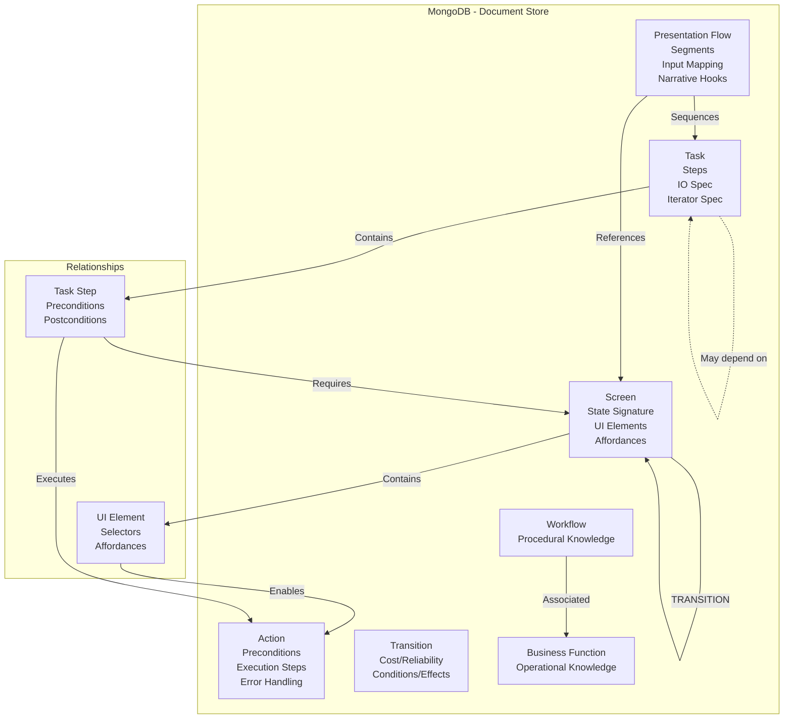
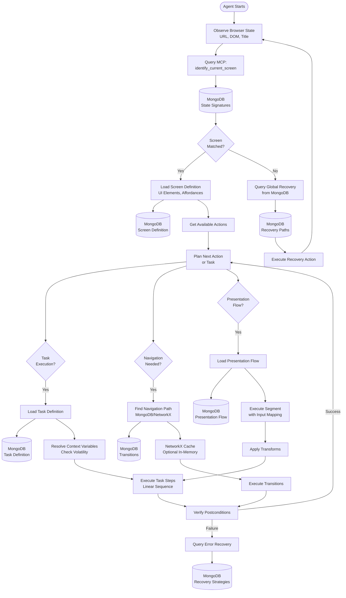

# Knowledge Extraction Architecture - General Guide

**Version**: 2.3.0  
**Last Updated**: January 18, 2026  
**Status**: Production Ready

This document provides the general architecture for the Browser Automation Service Knowledge Extraction system, covering S3 file-based ingestion, schema design, workflow orchestration, and implementation overview.

---

## Table of Contents

### Part I: S3 File-Based Ingestion
1. [S3 Ingestion Overview](#part-i-s3-file-based-ingestion)
2. [Quick Start Guide](#1-quick-start-guide)
3. [API Contracts & TypeScript Types](#2-api-contracts--typescript-types)
4. [Error Handling](#3-error-handling)
5. [Frontend Implementation](#4-frontend-implementation)
6. [Security & Performance](#5-security--performance)

### Part II: Knowledge Schema Design
7. [Schema Overview](#part-ii-knowledge-schema-design)
8. [Visual Architecture](#8-visual-architecture)
9. [Core Entities & Relationships](#9-core-entities--relationships)
10. [Cross-Reference System](#10-cross-reference-system)
11. [Navigation & Query Helpers](#11-navigation--query-helpers)
12. [JSON Schema Examples](#12-json-schema-examples)
13. [MongoDB-Only Architecture](#13-mongodb-only-architecture)
14. [Agent Reasoning](#14-how-the-agent-uses-this-knowledge)
15. [Production Considerations](#15-critical-improvements--production-considerations)
16. [Implementation Rules](#16-implementation-rules--enforcement)

### Part III: Extraction Workflow (General)
17. [Extraction Workflow](#17-extraction-workflow)
18. [Knowledge Extraction Pipeline](#18-knowledge-extraction-pipeline)
19. [Multi-Source Integration](#19-multi-source-integration)

### Part IV: Implementation Checklist
20. [Implementation Overview](#20-implementation-overview)
21. [Phase 1: Temporal Foundation](#21-phase-1-temporal-workflow-foundation-)
22. [Phase 2-8: Complete Pipeline](#22-phase-2-8-complete-implementation-pipeline)
23. [Validation & Testing](#23-validation--testing)
24. [Production Deployment](#24-production-deployment)

---

**Note**: For extraction-type-specific details, see:
- [Knowledge Extraction - Text Files](./KNOWLEDGE_EXTRACTION_TEXT_FILES.md) - PDF, Markdown, HTML, DOCX file processing
- [Knowledge Extraction - Public Documentation](./KNOWLEDGE_EXTRACTION_PUBLIC_DOCUMENTATION.md) - Public documentation crawling (Crawl4AI)
- [Knowledge Extraction - Authenticated Portal](./KNOWLEDGE_EXTRACTION_AUTHENTICATED_PORTAL.md) - Authenticated portal exploration (Browser-Use)
- [Knowledge Extraction - Video](./KNOWLEDGE_EXTRACTION_VIDEO.md) - Video file processing

---

# Part I: S3 File-Based Ingestion

## Overview

The Knowledge Extraction API supports **file-based ingestion via S3** (AWS S3 and DigitalOcean Spaces) using presigned URLs. This eliminates direct file uploads to the API and provides better scalability for large files.

### Architecture Flow

**Single File:**
```
UI → Upload to S3 → Generate Presigned URL → API → Download → Process
```

**Multiple Files:**
```
UI → Upload Multiple Files to S3 → Generate Presigned URLs → API → Download All → Process All (Batch)
```

### Key Features

- ✅ **No direct file uploads** (handles large files better)
- ✅ **Presigned URLs** with 1-hour expiry (secure)
- ✅ **Supports AWS S3** (IAM-based) and **DigitalOcean Spaces** (access key-based)
- ✅ **Single or multiple file processing** (batch ingestion in one workflow)
- ✅ **Automatic file type detection** from extensions
- ✅ **Streaming downloads** (memory-efficient)
- ✅ **Automatic retry** with exponential backoff
- ✅ **Comprehensive error handling** (410, 502, 404)

---

## 1. Quick Start Guide

### 1.1 AWS S3 Example

```bash
curl -X POST http://localhost:8000/api/knowledge/ingest/start \
  -H "Content-Type: application/json" \
  -d '{
    "source_type": "file",
    "source_name": "Product Documentation",
    "s3_reference": {
      "bucket": "knowledge-extraction",
      "key": "org-123/knowledge/know-456/docs.pdf",
      "region": "us-east-1",
      "presigned_url": "https://knowledge-extraction.s3.us-east-1.amazonaws.com/...",
      "expires_at": "2025-01-15T13:00:00Z"
    },
    "file_metadata": {
      "filename": "docs.pdf",
      "size": 2097152,
      "content_type": "application/pdf",
      "uploaded_at": "2025-01-15T12:00:00Z"
    }
  }'
```

### 1.2 Multiple Files Example (Batch Processing)

```bash
curl -X POST http://localhost:8000/api/knowledge/ingest/start \
  -H "Content-Type: application/json" \
  -d '{
    "source_type": "file",
    "source_name": "Documentation Set",
    "s3_references": [
      {
        "bucket": "knowledge-extraction",
        "key": "org-123/docs/doc1.pdf",
        "presigned_url": "https://...",
        "expires_at": "2025-01-15T13:00:00Z"
      },
      {
        "bucket": "knowledge-extraction",
        "key": "org-123/docs/doc2.pdf",
        "presigned_url": "https://...",
        "expires_at": "2025-01-15T13:00:00Z"
      }
    ],
    "file_metadata_list": [
      {
        "filename": "doc1.pdf",
        "size": 1048576,
        "content_type": "application/pdf",
        "uploaded_at": "2025-01-15T12:00:00Z"
      },
      {
        "filename": "doc2.pdf",
        "size": 2097152,
        "content_type": "application/pdf",
        "uploaded_at": "2025-01-15T12:00:00Z"
      }
    ]
  }'
```

**Key Points:**
- All files are processed in a **single workflow execution**
- Each file is ingested separately (creates separate ingestion results)
- Chunks from all files are **aggregated** for extraction phase
- One `job_id` tracks the entire batch
- If one file fails, others continue processing

### 1.3 DigitalOcean Spaces Example

```bash
curl -X POST http://localhost:8000/api/knowledge/ingest/start \
  -H "Content-Type: application/json" \
  -d '{
    "source_type": "file",
    "source_name": "Demo Video",
    "s3_reference": {
      "bucket": "knowledge-extraction",
      "key": "org-123/knowledge/know-789/demo.mp4",
      "endpoint": "https://nyc3.digitaloceanspaces.com",
      "presigned_url": "https://knowledge-extraction.nyc3.digitaloceanspaces.com/...",
      "expires_at": "2025-01-15T13:00:00Z"
    },
    "file_metadata": {
      "filename": "demo.mp4",
      "size": 15728640,
      "content_type": "video/mp4",
      "uploaded_at": "2025-01-15T12:00:00Z"
    }
  }'
```

### 1.4 Supported File Types

| Extension | Content Type | Auto-Detected As | Processing |
|-----------|-------------|------------------|------------|
| `.pdf` | `application/pdf` | Documentation | See [Text File Processing Guide](./KNOWLEDGE_EXTRACTION_TEXT_FILES.md) |
| `.md` | `text/markdown` | Documentation | See [Text File Processing Guide](./KNOWLEDGE_EXTRACTION_TEXT_FILES.md) |
| `.txt` | `text/plain` | Documentation | See [Text File Processing Guide](./KNOWLEDGE_EXTRACTION_TEXT_FILES.md) |
| `.html` | `text/html` | Documentation | See [Text File Processing Guide](./KNOWLEDGE_EXTRACTION_TEXT_FILES.md) |
| `.docx` | `application/vnd.openxmlformats-officedocument.wordprocessingml.document` | Documentation | See [Text File Processing Guide](./KNOWLEDGE_EXTRACTION_TEXT_FILES.md) |
| `.doc` | `application/msword` | Documentation | See [Text File Processing Guide](./KNOWLEDGE_EXTRACTION_TEXT_FILES.md) |
| `.mp4` | `video/mp4` | Video | See [Video Extraction Guide](./KNOWLEDGE_EXTRACTION_VIDEO.md) |
| `.webm` | `video/webm` | Video | See [Video Extraction Guide](./KNOWLEDGE_EXTRACTION_VIDEO.md) |
| `.mov` | `video/quicktime` | Video | See [Video Extraction Guide](./KNOWLEDGE_EXTRACTION_VIDEO.md) |
| `.avi` | `video/x-msvideo` | Video | See [Video Extraction Guide](./KNOWLEDGE_EXTRACTION_VIDEO.md) |
| `.mkv` | `video/x-matroska` | Video | See [Video Extraction Guide](./KNOWLEDGE_EXTRACTION_VIDEO.md) |

---

## 2. API Contracts & TypeScript Types

### 2.1 TypeScript Interfaces

```typescript
type SourceType = 'website' | 'documentation' | 'video' | 'file';

interface S3Reference {
  bucket: string;
  key: string;
  region?: string;           // For AWS S3
  endpoint?: string;         // For DigitalOcean Spaces
  presigned_url: string;     // Valid for 1 hour
  expires_at: string;        // ISO 8601 timestamp
}

interface FileMetadata {
  filename: string;
  size: number;              // Bytes
  content_type: string;      // MIME type
  uploaded_at: string;       // ISO 8601 timestamp
}

interface StartIngestionRequest {
  source_type: SourceType;
  source_url?: string;       // For URL-based (not required for file type)
  source_name?: string;
  s3_reference?: S3Reference;   // Required for file type
  file_metadata?: FileMetadata; // Required for file type
  options?: object;
  job_id?: string;
}

interface StartIngestionResponse {
  job_id: string;           // ← STORE THIS!
  workflow_id: string;
  status: 'queued';
  estimated_duration_seconds: number;
  message: string;
}
```

### 2.2 Validation Rules

| Condition | Requirement |
|-----------|-------------|
| `source_type='file'` | **MUST** include `s3_reference` AND `file_metadata` |
| `source_type!='file'` | **MUST** include `source_url` |
| Presigned URL | **MUST NOT** be expired |
| File size | **MUST** be > 0 |

---

## 3. Error Handling

### 3.1 HTTP Status Codes

| HTTP Status | Error | Cause | Solution |
|-------------|-------|-------|----------|
| **400** | Missing fields | `s3_reference` or `file_metadata` not provided | Include both fields |
| **410** | URL expired | Presigned URL expired | Generate new presigned URL |
| **502** | Download failed | Network error, S3 unavailable | Retry request |
| **404** | Object not found | File doesn't exist in S3 | Verify bucket/key |

### 3.2 Example Error Responses

**400 Bad Request (Missing Fields)**:
```json
{
  "detail": "s3_reference and file_metadata are required for file-based ingestion (source_type='file')"
}
```

**410 Gone (Expired URL)**:
```json
{
  "detail": "Presigned URL expired at 2025-01-15T10:00:00Z"
}
```

**502 Bad Gateway (Download Failed)**:
```json
{
  "detail": "Failed to download file from S3: Connection timeout"
}
```

---

## 4. Frontend Implementation

### 4.1 Complete TypeScript Example

```typescript
async function startKnowledgeExtraction(file: File) {
  // 1. Upload to S3
  const { bucket, key } = await uploadToS3(file);
  
  // 2. Generate presigned URL (1-hour expiry)
  const presignedUrl = await generatePresignedUrl(bucket, key);
  const expiresAt = new Date(Date.now() + 3600000).toISOString();
  
  // 3. Start knowledge extraction
  const response = await fetch('/api/knowledge/ingest/start', {
    method: 'POST',
    headers: { 'Content-Type': 'application/json' },
    body: JSON.stringify({
      source_type: 'file',
      source_name: file.name,
      s3_reference: {
        bucket,
        key,
        region: 'us-east-1',  // or endpoint for DigitalOcean
        presigned_url: presignedUrl,
        expires_at: expiresAt,
      },
      file_metadata: {
        filename: file.name,
        size: file.size,
        content_type: file.type,
        uploaded_at: new Date().toISOString(),
      },
    }),
  });
  
  if (!response.ok) {
    const error = await response.json();
    
    // Handle specific error codes
    if (response.status === 410) {
      // Presigned URL expired - regenerate and retry
      return startKnowledgeExtraction(file);
    }
    
    throw new Error(error.detail);
  }
  
  const result = await response.json();
  return result.job_id;
}
```

### 4.2 End-to-End Flow

```
1. UI → S3: Upload file (multipart)
2. UI → UI: Generate presigned URL (1-hour expiry)
3. UI → API: POST /ingest/start (s3_reference + file_metadata)
4. API → S3: Download file via presigned URL
5. API → Temporal: Start workflow (file:// URL)
6. Temporal: Process file → Extract knowledge
7. API → UI: Return job_id
8. UI: Poll /workflows/status/{job_id}
```

---

## 5. Security & Performance

### 5.1 Security Best Practices

**✅ DO**:
- Use 1-hour expiry for presigned URLs
- Use IAM roles in production (AWS S3)
- Enable server-side encryption (SSE-S3 or SSE-KMS)
- Restrict bucket policies to specific paths
- Start ingestion immediately after generating URL

**❌ DON'T**:
- Share S3 credentials in API requests
- Use overly long expiry times (> 1 hour)
- Store presigned URLs for later use
- Skip validation of file metadata

### 5.2 Performance Characteristics

| Metric | Value |
|--------|-------|
| Download Timeout | 5 minutes |
| Chunk Size | 1 MB |
| Retry Attempts | 3 with exponential backoff |
| Progress Logging | Every 10 MB |
| Memory Usage | Streaming (low) |

### 5.3 File Naming Convention

**Recommended Format**:
```
{org_id}/knowledge/{knowledge_id}/{timestamp}-{filename}
```

**Example**:
```
org-123/knowledge/know-456/20250115-120000-documentation.pdf
```

### 5.4 Environment Configuration

**Development (DigitalOcean Spaces)**:
```bash
S3_ENDPOINT=https://nyc3.digitaloceanspaces.com
S3_ACCESS_KEY_ID=your_access_key
S3_SECRET_ACCESS_KEY=your_secret_key
S3_BUCKET=knowledge-extraction
```

**Production (AWS S3 with IAM)**:
```bash
S3_REGION=us-east-1
S3_BUCKET=knowledge-extraction
# No credentials needed (IAM role)
```

---

# Part II: Knowledge Schema Design

## 7. Schema Overview

This schema separates **website operational knowledge** (how to navigate and interact) from **presentation flow knowledge** (how to tell a story), enabling the agent to reason about both navigation and narrative independently.

### 7.1 Core Principles

1. **State-Based Navigation**: Screens are first-class entities with explicit state representations
2. **Action Affordances**: UI elements are modeled as affordances (what actions they enable)
3. **Task Composition**: Complex tasks are composed of reusable sub-tasks and atomic actions
4. **MongoDB-Only Storage**: All knowledge stored in MongoDB. NetworkX used in-memory by agents when needed for graph operations.
5. **Conditional Execution**: Actions have preconditions, postconditions, and side effects
6. **Presentation Orthogonality**: Presentation flows reference tasks/screens but don't encode navigation logic

---

## 8. Visual Architecture

### 8.1 Entity Relationship Diagram



### 8.2 Knowledge Flow Diagram



---

## 9. Core Entities & Relationships

### 9.1 Entity Hierarchy

```
Website
├── ScreenGroup (Logical grouping of screens)
│   └── GroupMembership (Edge: Screen → ScreenGroup)
├── Screen (Page/State)
│   ├── UIElement
│   │   ├── Action
│   │   └── Selector
│   ├── StateSignature (how to recognize this screen)
│   └── AvailableActions
├── Task
│   ├── TaskStep
│   ├── Precondition
│   ├── Postcondition
│   └── ValidationRule
└── PresentationFlow
    ├── FlowSegment
    │   ├── InputMapping (maps context to task inputs)
    │   └── NarrativeHook
    └── VariableMapping (maps data between segments)
```

### 9.2 Relationship Types

**Navigation (MongoDB)**:
- `SCREEN → [TRANSITION] → SCREEN` (state transitions) - **Stored in `knowledge_transitions`**
- `UIELEMENT → [ENABLES] → ACTION` (affordances) - **Embedded in Screen document**
- `ACTION → [TRIGGERS] → TRANSITION` (action effects) - **Referenced in Transition document**

**Task Graph (MongoDB)**:
- `TASK → [CONTAINS] → TASKSTEP` (composition) - **Stored in MongoDB Task document (linear steps)**
- `TASKSTEP → [REQUIRES] → SCREEN` (prerequisites) - **Stored in MongoDB Task document**
- `TASKSTEP → [EXECUTES] → ACTION` (execution) - **Stored in MongoDB Task document**
- `TASK → [DEPENDS_ON] → TASK` (task dependencies) - **Stored in MongoDB Task document (references)**

**Presentation Flow (MongoDB)**:
- `PRESENTATIONFLOW → [SEQUENCES] → TASK` (narrative order)
- `PRESENTATIONFLOW → [OPTIONAL] → TASK` (skippable segments)

**Operational Knowledge (MongoDB)**:
- `WORKFLOW → [ASSOCIATED] → BUSINESS_FUNCTION` (operational context)

---

## 10. Cross-Reference System

### 10.1 Overview

The knowledge system uses **bidirectional cross-references** to link all entities (Business Functions, User Flows, Screens, Tasks, Actions, Transitions, Workflows) enabling easy navigation and understanding of relationships.

### 10.2 Design Principles

1. **Bidirectional Links**: Every relationship is stored in both directions
2. **Easy Navigation**: From any entity, you can find all related entities
3. **Graph Traversal**: Support path finding and flow navigation
4. **Query Performance**: Indexed fields for fast lookups
5. **Consistency**: Automatic maintenance of bidirectional links via `CrossReferenceManager`

### 10.3 Cross-Reference Fields

**Business Function** includes:
- `related_user_flows`: User flow IDs that implement this business function
- `related_screens`: Screen IDs used by this business function
- `related_tasks`: Task IDs that support this business function
- `related_workflows`: Workflow IDs that implement this business function
- `related_actions`: Action IDs used in this business function

**User Flow** includes:
- `related_screens`: Screen IDs in this flow
- `related_workflows`: Workflow IDs used in this flow
- `related_business_functions`: Business function IDs this flow supports
- `related_transitions`: Transition IDs between screens in this flow
- `related_tasks`: Task IDs that are part of this flow
- `related_actions`: Action IDs used in this flow
- `screen_sequence`: Ordered sequence of screens with transitions
- `entry_actions`: Action IDs that can start this flow
- `exit_actions`: Action IDs that complete this flow

**Screen** includes:
- `business_function_ids`: Business function IDs this screen supports
- `user_flow_ids`: User flow IDs that use this screen
- `task_ids`: Task IDs that can be performed on this screen
- `action_ids`: Action IDs available on this screen
- `incoming_transitions`: Transition IDs that lead TO this screen
- `outgoing_transitions`: Transition IDs that lead FROM this screen
- `workflow_ids`: Workflow IDs that include this screen

**Task** includes:
- `business_function_ids`: Business function IDs this task supports
- `user_flow_ids`: User flow IDs that include this task
- `screen_ids`: Screen IDs where this task can be performed
- `action_ids`: Action IDs used in this task
- `workflow_ids`: Workflow IDs that include this task
- `prerequisite_task_ids`: Task IDs that must complete before this task
- `dependent_task_ids`: Task IDs that depend on this task

**Action** includes:
- `screen_ids`: Screen IDs where this action is available
- `user_flow_ids`: User flow IDs that use this action
- `task_ids`: Task IDs that use this action
- `business_function_ids`: Business function IDs that use this action
- `triggered_transitions`: Transition IDs triggered by this action
- `workflow_ids`: Workflow IDs that include this action

**Transition** includes:
- `user_flow_ids`: User flow IDs that include this transition
- `action_id`: Action ID that triggers this transition
- `business_function_ids`: Business function IDs this transition supports
- `workflow_ids`: Workflow IDs that include this transition

**Workflow** includes:
- `business_function_id`: Business function ID this workflow implements
- `user_flow_ids`: User flow IDs that use this workflow
- `screen_ids`: Screen IDs included in this workflow
- `task_ids`: Task IDs included in this workflow
- `action_ids`: Action IDs included in this workflow
- `transition_ids`: Transition IDs included in this workflow

### 10.4 Automatic Link Maintenance

The `CrossReferenceManager` service (`navigator/knowledge/persist/cross_references.py`) automatically maintains bidirectional links when entities are saved:

- When a screen is saved, it updates related business functions, user flows, tasks, actions, and transitions
- When a user flow is saved, it updates related screens, business functions, actions, and tasks
- When a transition is saved, it updates related screens and actions
- All updates use MongoDB's `$addToSet` for efficient, idempotent updates

### 10.5 Query Examples

**From a Screen:**
- "What business features use the Dashboard screen?" → `screen.business_function_ids`
- "What user flows include the Agent List screen?" → `screen.user_flow_ids`
- "What actions are available on the Settings screen?" → `screen.action_ids`
- "What screens can I navigate to from Dashboard?" → Query transitions where `from_screen_id = screen.screen_id`

**From a Business Function:**
- "What user flows implement Call Analytics?" → `business_function.related_user_flows`
- "What screens are part of Agent Management?" → `business_function.related_screens`
- "What tasks support Order Processing?" → `business_function.related_tasks`

**From a User Flow:**
- "What screens are in the 'Create Agent' flow?" → `user_flow.screen_sequence` (ordered)
- "What actions can start the 'View Dashboard' flow?" → `user_flow.entry_actions`
- "What tasks are part of the 'Checkout' flow?" → `user_flow.related_tasks`

---

## 11. Navigation & Query Helpers

### 11.1 Overview

High-level navigation functions (`navigator/knowledge/persist/navigation.py`) leverage cross-references to provide complete navigation paths, flow instructions, and context for knowledge entities.

### 11.2 Available Functions

**`get_navigation_path(from_screen_id, to_screen_id, knowledge_id, job_id=None)`**
- Finds the shortest path between two screens
- Returns enriched path with actions, transitions, and step-by-step instructions
- Uses `find_shortest_path` from `navigator/knowledge/graph/queries.py` with cross-references

**`get_flow_navigation(user_flow_id, knowledge_id, job_id=None)`**
- Returns complete navigation instructions for a user flow
- Includes ordered screen sequence with actions
- Provides step-by-step instructions
- Returns Mermaid diagram for visualization

**`get_business_feature_flows(business_function_id, knowledge_id, job_id=None)`**
- Retrieves all related user flows, workflows, screens, and actions
- Includes complete flow navigation for each user flow
- Shows how business features are implemented

**`get_screen_context(screen_id, knowledge_id, job_id=None)`**
- Provides comprehensive context for a screen
- Includes related business functions, user flows, available actions and tasks
- Shows both incoming and outgoing navigation transitions

### 11.3 Usage Examples

```python
from navigator.knowledge.persist.navigation import (
    get_navigation_path,
    get_flow_navigation,
    get_business_feature_flows,
    get_screen_context
)

# Find path from Dashboard to Agent Create screen
path = await get_navigation_path(
    from_screen_id="dashboard",
    to_screen_id="agent_create",
    knowledge_id="know-123"
)
# Returns: {
#   'path': [screen1, screen2, screen3],
#   'transitions': [transition1, transition2],
#   'actions': [action1, action2],
#   'instructions': ['Step 1: ...', 'Step 2: ...']
# }

# Get complete user flow navigation
flow_nav = await get_flow_navigation(
    user_flow_id="flow-123",
    knowledge_id="know-123"
)
# Returns: {
#   'flow_name': 'View Call Dashboard',
#   'screens': [...],
#   'navigation_instructions': [...],
#   'mermaid_diagram': '...'
# }

# Get all flows for a business feature
feature_flows = await get_business_feature_flows(
    business_function_id="call_analytics",
    knowledge_id="know-123"
)
# Returns: {
#   'business_function': {...},
#   'user_flows': [...],
#   'workflows': [...],
#   'screens': [...],
#   'actions': [...]
# }

# Get complete screen context
context = await get_screen_context(
    screen_id="dashboard",
    knowledge_id="know-123"
)
# Returns: {
#   'screen': {...},
#   'business_functions': [...],
#   'user_flows': [...],
#   'available_actions': [...],
#   'available_tasks': [...],
#   'incoming_transitions': [...],
#   'outgoing_transitions': [...]
# }
```

### 11.4 Path Finding Algorithm

The system uses **Breadth-First Search (BFS)** for path finding:

1. Start from source screen
2. Query MongoDB for outgoing transitions
3. Follow transitions to adjacent screens
4. Continue until target screen is reached
5. Return shortest path with all transitions and actions

**Optional NetworkX Cache**: For frequently accessed paths, NetworkX can be used as an in-memory cache for faster path finding. The system falls back to MongoDB BFS if NetworkX is not available.

---

## 12. JSON Schema Examples

All knowledge entities are stored in MongoDB. Key entity types include:

- **Screen Definition** (MongoDB): State signatures, UI elements, affordances
- **Action Definition** (MongoDB): Parameters, preconditions, execution steps, idempotency
- **Task Definition** (MongoDB): IO spec, linear steps, iterator spec, success criteria
- **Transition Definition** (MongoDB): Conditions, effects, cost, reliability
- **Presentation Flow** (MongoDB): Segments, input mapping, narrative hooks, transforms
- **Business Function** (MongoDB): Business function definitions with operational aspects
- **Workflow** (MongoDB): Operational workflow definitions with steps

**All entities use MongoDB collections** prefixed with `knowledge_` (e.g., `knowledge_screens`, `knowledge_tasks`, `knowledge_transitions`).

---

## 13. MongoDB-Only Architecture

### 13.1 MongoDB (Document Store) - Complete Knowledge Storage

**Collections**:
- `knowledge_screens` - Complete screen definitions with UI elements, selectors, affordances, state signatures
- `knowledge_tasks` - Multi-step workflows with ordered steps, preconditions, postconditions, IO specs
- `knowledge_actions` - Action templates with parameters, execution steps, error handling
- `knowledge_transitions` - State transitions with conditions, effects, cost, reliability metrics
- `knowledge_business_functions` - Business function definitions (operational knowledge)
- `knowledge_workflows` - Operational workflow definitions (procedural knowledge)
- `knowledge_presentation_flows` - Narrative sequences, segments, hooks, transitions

**Why MongoDB**:
- Documents are self-contained and easy to query by ID
- Rich nested structures for complex UI element definitions
- Easy to version and update individual screens/tasks
- Good for template-based knowledge (actions, tasks are templates)
- **Task steps are linear sequences** - storing in MongoDB avoids graph traversal overhead
- **Single document read** for complete task definition vs. multiple graph hops

**Knowledge ID for Persistence & Querying**:
- All entities can be stored and queried by `knowledge_id`
- `knowledge_id` is the primary identifier for grouping and searching knowledge
- When resyncing/re-extracting with the same `knowledge_id`, old knowledge is automatically **replaced** using MongoDB's native `delete_many` (filtered by `knowledge_id`) followed by `upsert=True` (replace-on-insert)
- This ensures clean replacement without orphaned entities

**Query Patterns**:
```javascript
// Find all screens for a website
db.screens.find({ website_id: "spadeworks" })

// Find all screens for a knowledge_id (NEW - recommended for querying)
db.screens.find({ knowledge_id: "know-abc-123" })

// Find task by ID
db.tasks.findOne({ task_id: "create_agent" })

// Find all tasks for a knowledge_id (NEW - recommended for querying)
db.tasks.find({ knowledge_id: "know-abc-123" })

// Find all tasks that use a specific screen
db.tasks.find({ "steps.action.target_screen": "agent_create" })
```

### 13.2 Graph Operations (NetworkX in-Memory)

**For Simple Queries**:
- Direct MongoDB queries (fast, simple)
- Examples: `get_transitions_from_screen`, `search_screens_by_name`, `get_adjacent_screens`

**For Path Finding**:
- **Option 1**: MongoDB BFS (breadth-first search) - simple, works for small graphs
- **Option 2**: NetworkX cache (in-memory) - fast, built from MongoDB when needed

**NetworkX Usage**:
- Agents can build NetworkX graph in-memory when needed
- Loads from MongoDB on-demand
- No persistent cache - rebuilt as needed
- Fast path finding (< 10ms for small graphs)

**Graph Query Functions** (Location: `navigator/knowledge/graph/queries.py`):
```python
from navigator.knowledge.graph.queries import find_shortest_path, get_adjacent_screens

# Find shortest path (uses NetworkX if available, otherwise MongoDB BFS)
path = await find_shortest_path(
    source_screen_id="dashboard",
    target_screen_id="agent_create",
    website_id="example.com",  # Optional, but recommended for NetworkX cache
    use_networkx=True  # Optional: use NetworkX cache if available
)

# Get adjacent screens (uses MongoDB queries directly)
adjacent = await get_adjacent_screens(screen_id="dashboard", website_id="example.com")
```

**NetworkX Cache** (Location: `navigator/knowledge/graph/cache.py`):
```python
from navigator.knowledge.graph.cache import get_graph_cache

cache = get_graph_cache()
graph = await cache.get_navigation_graph(website_id)
path = await cache.find_shortest_path(website_id, source, target)
```

---

## 12. How the Agent Uses This Knowledge

### 12.1 Screen Recognition & State Awareness

**Step 1: Recognize Current Screen**
```python
# Query MongoDB for state signatures matching current DOM/URL
current_url = browser.get_url()
current_dom = browser.get_dom_summary()

# Match against state signatures
screen = db.screens.find_one({
    "url_patterns": { "$regex": current_url },
    "state_signature.required_indicators": { "$elemMatch": { "matches": current_dom } }
})

# Calculate confidence score
confidence = calculate_match_confidence(screen["state_signature"], current_dom, current_url)
```

**Step 2: Load Screen Knowledge**
```python
# Load complete screen definition
screen_doc = db.screens.find_one({ "screen_id": screen["screen_id"] })

# Extract available actions
available_actions = []
for element in screen_doc["ui_elements"]:
    for affordance in element["affordances"]:
        available_actions.append({
            "action_type": affordance["action_type"],
            "element_id": element["element_id"],
            "preconditions": affordance.get("preconditions", [])
        })
```

### 12.2 Task Planning & Execution

**Step 3: Plan Task Execution**
```python
# Load task definition
task = db.tasks.find_one({ "task_id": "create_agent" })

# Check preconditions for first step
first_step = task["steps"][0]
if check_preconditions(first_step["preconditions"]):
    # Execute step
    execute_action(first_step["action"])
    
    # Validate postconditions
    if validate_postconditions(first_step["postconditions"]):
        # Move to next step
        continue
    else:
        # Handle failure
        handle_error(first_step["error_handling"])
```

**Step 4: Navigate Between Screens**
```python
# Query MongoDB for navigation path (with optional NetworkX cache)
from navigator.knowledge.graph.queries import find_shortest_path

target_screen = "agent_create"
current_screen = "dashboard"

# Find shortest path (uses NetworkX if available, otherwise MongoDB BFS)
path = await find_shortest_path(
    source_screen_id=current_screen,
    target_screen_id=target_screen,
    website_id="example.com",
    use_networkx=True  # Optional: use NetworkX cache if available
)

# Execute transitions in path
for transition in path:
    action = transition["trigger_action"]
    execute_action(action)
    wait_for_transition(transition.get("cost", {}).get("estimated_ms", 1000))
```

---

## 15. Critical Improvements & Production Considerations

### 15.1 Runtime Context Management

**Problem**: Tasks use variables like `{agent_name}` but schema doesn't define how values are resolved or persisted.

**Solution**: Added `io_spec` to Task definition with:
- **Inputs**: Required parameters with types, sources, and defaults
- **Outputs**: Extracted values with extraction methods (DOM, URL parsing, context reference)
- **Context Persistence**: Session vs. global scope
- **Variable Resolution Order**: Task context → Session context → Global context → User input

### 13.2 Presentation Flow Variable Mapping

**Problem**: Tasks have `io_spec` for inputs/outputs, but Presentation Flow segments need to map context values to task inputs and pass data between segments.

**Solution**: Added `input_mapping` to Presentation Flow segments:

**Input Mapping Sources**:
- `generated_value`: Generate value using generator (e.g., "human_name" → "Agent Smith")
- `hardcoded`: Fixed value for this demo
- `session_context`: Retrieve from session context (persisted from previous segment)
- `user_input`: Get from user during conversation
- `task_output`: Use output from previous task execution

### 13.3 MongoDB Storage Boundary Clarification

**Critical Correction**: Task steps are **NOT** graph nodes. They are **linear sequences** stored in MongoDB Task documents.

**Why This Matters**:
- Fetching 10-step task: **1 MongoDB query** (vs. multiple graph hops if stored as nodes)
- Performance: Document reads are faster than graph traversal for linear sequences
- NetworkX is used optionally for path finding when needed, not for storing task steps

### 13.4 Parameterized Selectors

**Problem**: Static selectors can't handle dynamic lists (e.g., "Click the row containing 'Bob'").

**Solution**: Added `parameterized: true` flag and `parameterized` selector strategy for dynamic element selection.

### 13.5 Negative State Signatures

**Problem**: Create and Edit modes often look 90% identical. Need to distinguish them.

**Solution**: Added `negative_indicators` to state signatures. If negative indicator present → **exclude** this screen match.

### 13.6 Cost and Reliability Edge Attributes

**Problem**: Multiple paths exist, but agent can't optimize for speed vs. reliability.

**Solution**: Added to Transition edges:
- `cost`: Estimated duration and complexity
- `reliability_score`: Success rate based on metrics
- `reliability_metrics`: Success/failure counts, rolling average

### 13.7 Idempotency & Reversibility

**Problem**: Agent doesn't know if it's safe to retry failed actions.

**Solution**: Added to Action definition:
- `idempotent`: Boolean flag
- `reversible_by`: Action ID for undo
- `reversibility`: Parameters for reversal

### 13.8 Observability Triggers

**Problem**: Hardcoded `wait` durations are brittle and inefficient.

**Solution**: Replaced with observability triggers:
- `dom_mutation`: Wait for DOM change
- `network_idle`: Wait for network completion
- `element_visible`: Wait for element appearance
- `url_change`: Wait for navigation

### 13.9 ScreenGroup and Global Fallback Graph

**Problem**: Agent gets lost (screen signature match = 0%), needs universal recovery.

**Solution**: ScreenGroup entities stored in MongoDB with priority-based recovery:
1. Agent recognizes unknown/low-confidence screen
2. Queries MongoDB for screen groups and recovery paths
3. Sorts recovery paths by `recovery_priority` (ascending: 1 = highest priority)
4. Selects highest priority recovery path
5. Executes recovery action
6. Re-identifies screen from known safe state

### 13.10 Iterator Logic Formalization

**Problem**: Loops are banned in MongoDB task steps, but iteration logic is delegated to agent code.

**Solution**: Add `iterator_spec` to Task definition:
- `type`: collection_processing, list_processing, pagination, none
- `collection_selector`: DOM selector for items
- `item_action`: Task to execute per item
- `termination_condition`: When to stop
- `max_iterations`: Safety limit
- `error_handling`: Abort vs. continue on error

### 13.11 Soft vs. Hard Preconditions

**Problem**: All preconditions are treated as binary checks.

**Solution**: Distinguish between `hard_dependencies` (must fail) and `soft_dependencies` (can auto-remediate).

### 13.12 Context Volatility Flags

**Problem**: Some context values are time-sensitive (MFA tokens) and must be scraped fresh.

**Solution**: Add `volatility` flag to inputs:
- `low`: Stable data (usernames) - can be cached indefinitely
- `medium`: Data with TTL (session IDs) - refresh after expiration
- `high`: Time-sensitive data (MFA tokens) - always scrape fresh

---

## 16. Implementation Rules & Enforcement

### 16.1 The "No-Graph-Loops" Rule

**Rule**: A `Task` document in MongoDB must **never** contain a loop. Task steps are linear sequences.

**Rationale**: 
- Task steps are stored in MongoDB for performance (single document read)
- Loops require dynamic control flow that belongs in code, not knowledge
- Iterator specs handle iteration logic explicitly

**Enforcement**:
- If a task requires iteration, model it using `iterator_spec` in the Task definition
- Agent code handles loop logic using Task definition as body

### 14.2 The "Context-First" Rule

**Rule**: The agent must resolve **all** `{variables}` in the `io_spec` **before** attempting to execute step 1 of any task.

**Rationale**:
- Prevents partial execution failures
- Ensures all required inputs are available
- Enables proper error handling before action execution

**Enforcement**:
1. Load task definition
2. Extract all variables from `io_spec.inputs`
3. Resolve each variable with volatility check
4. Apply transforms pipeline
5. Handle missing variables (pause or skip)

### 14.3 The "Negative-Signature" Priority Rule

**Rule**: When matching screens, `negative_indicators` must be checked **first**. If a negative indicator is present, the screen match is **immediately discarded**.

**Rationale**:
- Negative indicators are more specific and reliable
- Prevents false positives (e.g., Create vs. Edit mode)
- Faster rejection of incorrect matches

**Enforcement**:
```
FOR each candidate_screen:
  // Step 1: Check negative indicators FIRST
  IF any negative_indicator matches:
    REJECT candidate_screen immediately
    CONTINUE to next candidate
  
  // Step 2: Check exclusion indicators
  IF any exclusion_indicator matches:
    REJECT candidate_screen
    CONTINUE to next candidate
  
  // Step 3: Calculate positive match score
  score = calculate_match_score(required_indicators, optional_indicators)
  
  // Step 4: Accept if score > threshold
  IF score > confidence_threshold:
    ACCEPT candidate_screen
```

---

# Part III: Knowledge Extraction Process (General)

## 17. Extraction Workflow

### 17.1 Temporal Workflow

**Workflow**: `KnowledgeExtractionWorkflowV2`

**Location**: `navigator/temporal/workflows_extraction.py`

**Phases**:
1. **Ingest Source**: Load content from documentation/website/video
   - For videos: See [Video Extraction Guide](./KNOWLEDGE_EXTRACTION_VIDEO.md)
   - For text files: See [Text File Processing Guide](./KNOWLEDGE_EXTRACTION_TEXT_FILES.md)
   - For websites: See [Public Documentation Guide](./KNOWLEDGE_EXTRACTION_PUBLIC_DOCUMENTATION.md) or [Authenticated Portal Guide](./KNOWLEDGE_EXTRACTION_AUTHENTICATED_PORTAL.md)
2. **Extract Screens**: Identify application states and UI elements
3. **Extract Tasks**: Parse workflows and task sequences
4. **Extract Actions**: Extract atomic operations and interactions
5. **Extract Transitions**: Identify state changes and navigation paths
6. **Extract Business Functions**: LLM analysis to identify business functions (from all sources)
7. **Extract Workflows**: LLM analysis to extract operational workflows (from all sources)
8. **Validate Knowledge**: Verify extracted knowledge consistency
9. **Verify Extraction**: Validate extracted knowledge with browser replay (optional)
10. **Enrich Knowledge**: Improve knowledge quality based on verification (optional)

**Input Schema**:
```json
{
  "job_id": "string (UUID)",
  "source_type": "string (enum: documentation, website, video, file)",
  "source_url": "string (optional for file type)",
  "website_url": "string (optional, for Phase 2: Website DOM Analysis)",
  "website_name": "string (optional)",
  "credentials": "object (optional, username/password for Phase 2)",
  "documentation_urls": ["string (optional, public docs URLs)"],
  "s3_references": ["object (optional, for file type)"],
  "file_metadata_list": ["object (optional, for file type)"],
  "knowledge_id": "string (optional, recommended for persistence and querying)",
  "extraction_options": {
    "max_depth": "integer (for website crawling)",
    "include_paths": ["string"],
    "exclude_paths": ["string"]
  }
}
```

**Knowledge ID Behavior**:
- If `knowledge_id` is provided and exists in database, all existing knowledge for that ID is **replaced** using MongoDB's native `delete_many` (by `knowledge_id` filter) before saving new knowledge
- New entities are saved with `upsert=True` (MongoDB's replace-on-insert)
- This ensures clean replacement when resyncing/re-extracting knowledge for an existing `knowledge_id`

**Output Schema**:
```json
{
  "job_id": "string",
  "status": "string (completed, failed)",
  "stats": {
    "screens_extracted": "integer",
    "tasks_extracted": "integer",
    "actions_extracted": "integer",
    "transitions_extracted": "integer",
    "business_functions_extracted": "integer",
    "workflows_extracted": "integer"
  },
  "errors": ["string"],
  "duration_seconds": "float"
}
```

### 17.2 Idempotency

All activities are **idempotent** using MongoDB-based idempotency manager.

**Mechanism**:
1. Check if operation already completed (query idempotency store)
2. If completed, return cached result
3. If not completed, execute operation and cache result
4. Handle concurrent requests with TTL-based locks

**Benefits**:
- Safe retries after transient failures
- No duplicate data on retry
- Workflow can be replayed from any point

---

## 18. Knowledge Extraction Pipeline

### 18.1 Screen Extraction

**Activity**: `extract_screens_v2`

**Location**: `navigator/temporal/activities_extraction.py`

**Process**:
1. Load content chunks from ingestion results (supports multi-source)
2. Parse content for screen indicators (URL patterns, headings, DOM elements)
3. Extract UI elements and selectors
4. Generate state signatures (indicators, negative indicators)
5. Determine available actions
6. Persist to MongoDB (`knowledge_screens`) with `knowledge_id` if provided

**Output**: Array of `ScreenDefinition` objects

### 18.2 Task Extraction

**Activity**: `extract_tasks_v2`

**Process**:
1. Load content chunks from ingestion results
2. Identify workflows and procedures
3. Parse step-by-step instructions
4. Extract preconditions and postconditions
5. Generate IO specifications (inputs/outputs, volatility)
6. Link to required screens and actions
7. Persist to MongoDB (`knowledge_tasks`) with `knowledge_id` if provided

**Output**: Array of `TaskDefinition` objects

### 18.3 Action Extraction

**Activity**: `extract_actions_v2`

**Process**:
1. Load content chunks from ingestion results
2. Parse UI interactions and descriptions
3. Generate execution steps (browser commands)
4. Define preconditions and postconditions
5. Set up error handling strategies
6. Persist to MongoDB (`knowledge_actions`) with `knowledge_id` if provided

**Output**: Array of `ActionDefinition` objects

### 18.4 Transition Extraction

**Activity**: `extract_transitions_v2`

**Process**:
1. Load content chunks from ingestion results
2. Identify screen-to-screen navigation patterns
3. Link actions to transitions (trigger_action)
4. Calculate cost and reliability metrics
5. Define conditions and effects
6. Persist to MongoDB (`knowledge_transitions`) with `knowledge_id` if provided

**Output**: Array of `TransitionDefinition` objects

### 18.5 Business Function Extraction

**Activity**: `extract_business_functions_v2`

**Process**:
1. Load content chunks from all ingestion results (supports all source types)
2. LLM analysis to identify business functions (OpenAI GPT-4o or Gemini 1.5 Pro)
3. Extract business reasoning (EXTENSIVE multi-paragraph explanations - why functions exist, what problems they solve)
4. Extract business impact (EXTENSIVE multi-paragraph explanations - business value, impact, outcomes)
5. Extract business requirements (EXTENSIVE list with detailed explanations - explicit requirements that led to functions)
6. Extract operational aspects (technical requirements, validations, side effects)
7. Classify by category (User Management, Order Processing, etc.)
8. Persist to MongoDB (`knowledge_business_functions`) with `knowledge_id` if provided

**Supported Source Types**:
- ✅ **Video**: Transcription, frame analysis, action sequences (see [Video Extraction Guide](./KNOWLEDGE_EXTRACTION_VIDEO.md))
- ✅ **Text Files**: Markdown, PDF, DOCX, HTML, text content (see [Text File Processing Guide](./KNOWLEDGE_EXTRACTION_TEXT_FILES.md))
- ✅ **Website Crawling**: Crawled pages (Crawl4AI: `documentation` chunks, Browser-Use: `webpage` chunks) (see [Public Documentation Guide](./KNOWLEDGE_EXTRACTION_PUBLIC_DOCUMENTATION.md) and [Authenticated Portal Guide](./KNOWLEDGE_EXTRACTION_AUTHENTICATED_PORTAL.md))
- ✅ **Exploration**: Live page exploration results (`exploration` chunks)

**Supported Providers**:
- **OpenAI GPT-4o**: Primary choice
- **Google Gemini 1.5 Pro**: Fallback option

**Output**: Array of `BusinessFunction` objects with reasoning, impact, and requirements

### 18.6 Operational Workflow Extraction

**Activity**: `extract_workflows_v2`

**Process**:
1. Load content chunks from all ingestion results (supports all source types)
2. LLM analysis to structure as step-by-step workflows
3. Extract business reasoning (why workflows exist, what problems they solve)
4. Extract business impact (business value, impact, outcomes)
5. Extract business requirements (explicit requirements that led to workflows)
6. Extract preconditions, postconditions, error handling
7. Link steps to screens and actions
8. Associate with business functions
9. Persist to MongoDB (`knowledge_workflows`)

**Supported Source Types**:
- ✅ **Video**: Transcription, frame analysis, action sequences (see [Video Extraction Guide](./KNOWLEDGE_EXTRACTION_VIDEO.md))
- ✅ **Text Files**: Markdown, PDF, DOCX, HTML, text content (see [Text File Processing Guide](./KNOWLEDGE_EXTRACTION_TEXT_FILES.md))
- ✅ **Website Crawling**: Crawled pages (Crawl4AI: `documentation` chunks, Browser-Use: `webpage` chunks) (see [Public Documentation Guide](./KNOWLEDGE_EXTRACTION_PUBLIC_DOCUMENTATION.md) and [Authenticated Portal Guide](./KNOWLEDGE_EXTRACTION_AUTHENTICATED_PORTAL.md))
- ✅ **Exploration**: Live page exploration results (`exploration` chunks)

**Supported Providers**:
- **OpenAI GPT-4o**: Primary choice
- **Google Gemini 1.5 Pro**: Fallback option

**Output**: Array of `OperationalWorkflow` objects with reasoning, impact, and requirements

### 18.7 Knowledge ID Persistence & Replacement

**Knowledge ID Workflow**:
1. If `knowledge_id` is provided in extraction request, it flows through: API → Workflow → Activities
2. **Before Extraction**: If `knowledge_id` exists in database, all existing knowledge for that ID is **replaced** using MongoDB's native `delete_many({ knowledge_id: "..." })` operation
3. **During Extraction**: All extracted entities (screens, tasks, actions, transitions, business functions, workflows) are saved with `knowledge_id` using `upsert=True` (MongoDB's replace-on-insert)
4. **After Extraction**: All knowledge can be queried by `knowledge_id` using MongoDB's indexed queries

**Replacement Behavior (Resync/Re-extraction)**:
- When resyncing/re-extracting with the same `knowledge_id`, old knowledge is automatically replaced
- Uses MongoDB's native operations: `delete_many` (bulk delete by filter) followed by `upsert` (replace-on-insert)
- Ensures clean replacement without orphaned entities from previous extractions
- All entity types are replaced: screens, tasks, actions, transitions, business functions, workflows

**Query Functions by Knowledge ID**:
- `query_screens_by_knowledge_id(knowledge_id)` - Get all screens for a knowledge ID
- `query_tasks_by_knowledge_id(knowledge_id)` - Get all tasks for a knowledge ID
- `query_transitions_by_knowledge_id(knowledge_id)` - Get all transitions for a knowledge ID
- `query_business_functions_by_knowledge_id(knowledge_id)` - Get all business functions for a knowledge ID
- `query_workflows_by_knowledge_id(knowledge_id)` - Get all workflows for a knowledge ID

**MongoDB Indexes**:
- All collections have indexes on `knowledge_id` for efficient queries
- Indexes are automatically created when collections are initialized

---

## 19. Multi-Source Integration

### 19.1 Supported Sources

All extraction activities support **multi-source aggregation** via `ingestion_ids[]` parameter:

- **Video Files**: `.mp4`, `.webm`, `.mov`, `.avi`, `.mkv` (see [Video Extraction Guide](./KNOWLEDGE_EXTRACTION_VIDEO.md))
- **Text Files**: `.md`, `.html`, `.pdf`, `.txt`, `.docx`, `.doc` (see [Text File Processing Guide](./KNOWLEDGE_EXTRACTION_TEXT_FILES.md))
- **Website URLs**: Public documentation sites (Crawl4AI) or authenticated (Browser-Use) (see [Public Documentation Guide](./KNOWLEDGE_EXTRACTION_PUBLIC_DOCUMENTATION.md) and [Authenticated Portal Guide](./KNOWLEDGE_EXTRACTION_AUTHENTICATED_PORTAL.md))
- **Exploration**: Authenticated page exploration with form extraction

### 19.2 Multi-Source Aggregation

**Key Feature**: All extraction activities support `ingestion_ids[]` parameter to load chunks from multiple ingestion results:

```python
ExtractScreensInput(
    ingestion_id=primary_id,  # For backward compatibility
    ingestion_ids=[video_id, doc_id, website_id, exploration_id]  # All sources
)
```

**Benefits**:
- Merges knowledge from all sources (video + docs + website + exploration)
- Deduplicates entities (screens, tasks, actions) across sources
- Creates unified knowledge base
- Single workflow execution for all sources

### 19.3 Knowledge Merging & Deduplication

**Automatic Deduplication**:
- Screens: By URL pattern and state signature
- Tasks: By name and step sequence
- Actions: By action type and target
- Transitions: By source/target screen pairs

**Cross-Source Merging**:
- Same screen found in video + docs + website → Single unified screen
- Same task described in multiple sources → Enriched with all details
- Form actions from exploration + content actions → Combined action set

---

# Part IV: Implementation Checklist

## 20. Implementation Overview

### 20.1 Project Status

**Status**: ✅ **PRODUCTION READY** (All 8 phases complete)

**Last Updated**: January 18, 2026

**Total Implementation**:
- ~13,600 lines of production code
- ~5,000 lines of test code
- 120+ tests passing (100% success rate)

### 20.2 Implementation Phases

- ✅ **Phase 1**: Temporal Workflow Foundation (COMPLETE)
- ✅ **Phase 2**: Multi-Source Ingestion (COMPLETE)
- ✅ **Phase 3**: Knowledge Extraction & Normalization (COMPLETE)
- ✅ **Phase 4**: Knowledge Validation (COMPLETE)
- ✅ **Phase 5**: Persistence & State Management (COMPLETE)
- ✅ **Phase 6**: REST API Upgrades (COMPLETE)
- ✅ **Phase 7**: Browser-Based Verification (COMPLETE)
- ✅ **Phase 8**: End-to-End Validation (COMPLETE)

### 20.3 Critical Schema Compliance

This implementation is **100% aligned** with the Knowledge Schema Design and explicitly addresses all "Agent-Killer" edge cases:

1. **🔄 Loops (Iterator Spec)**: Phase 3.5 converts documentation loops to `iterator_spec` JSON
2. **❌ Negative Indicators**: Phase 3.1 extracts distinguishing features to differentiate similar screens
3. **🔧 Context Resolution (IO Spec)**: Phase 3.2 and 7.7 extract variables and enforce Context-First Rule
4. **🔗 Recovery Priority**: Phase 4.6 assigns priorities to global recovery edges

**Architecture**: MongoDB-only storage with optional NetworkX for graph operations. Temporal for workflow orchestration.

---

## 21. Phase 1: Temporal Workflow Foundation ✅

**Status**: COMPLETE  
**Completion Date**: 2026-01-14

**Summary**: Complete Temporal workflow foundation with unified task queue architecture. Runs Knowledge Extraction Workflow V2 for comprehensive knowledge extraction.

**Key Artifacts**:

*Code Files*:
- `navigator/temporal/workflows_extraction.py` - Main workflow with phases
- `navigator/temporal/activities_extraction.py` - Idempotent extraction activities
- `navigator/temporal/worker.py` - Unified worker (single task queue)
- `navigator/temporal/config.py` - Configuration
- `tests/ci/test_temporal_foundation.py` - Validation tests

**Infrastructure**:
- **Temporal Server**: `localhost:7233`
- **Temporal UI**: `http://localhost:8080`
- **Task Queue**: `knowledge-extraction-queue`
- **Workflow Timeout**: 2 hours (7200s)
- **Activity Timeout**: 2 minutes (120s)

**Docker Services Running**:
- `temporal-postgresql` (Port 5432) - PostgreSQL 13
- `temporal` (Port 7233) - Temporal server (v1.24.2)
- `temporal-ui` (Port 8080) - Web UI

---

## 22. Phase 2-8: Complete Implementation Pipeline

### Phase 2: Multi-Source Ingestion ✅

**Ingestion Types**:
- **Website crawling**: See [Public Documentation Guide](./KNOWLEDGE_EXTRACTION_PUBLIC_DOCUMENTATION.md) and [Authenticated Portal Guide](./KNOWLEDGE_EXTRACTION_AUTHENTICATED_PORTAL.md)
- **Text file processing**: See [Text File Processing Guide](./KNOWLEDGE_EXTRACTION_TEXT_FILES.md)
- **Video walkthrough ingestion**: See [Video Extraction Guide](./KNOWLEDGE_EXTRACTION_VIDEO.md)
- **S3-based file upload** (see Part I)

**Key Features**:
- Unified ingestion router
- Source type detection
- Content chunking
- Deduplication via content hashing

### Phase 3: Knowledge Extraction & Normalization ✅

**Extraction Activities**:
- Screen extraction with state signatures
- Task extraction with IO specs
- Action extraction with preconditions
- Transition extraction with cost/reliability
- **Business function extraction** (from all sources, using OpenAI/Gemini)
- **Operational workflow extraction** (from all sources, using OpenAI/Gemini)
- Negative indicator detection

**AI Providers Used**:
- **Faster-Whisper**: Video transcription (local CPU-based, see [Video Extraction Guide](./KNOWLEDGE_EXTRACTION_VIDEO.md))
- **OpenAI GPT-4o Vision**: Frame analysis + OCR (primary, see [Video Extraction Guide](./KNOWLEDGE_EXTRACTION_VIDEO.md))
- **Google Gemini 1.5 Pro Vision**: Frame analysis + OCR (fallback, see [Video Extraction Guide](./KNOWLEDGE_EXTRACTION_VIDEO.md))
- **Tesseract**: OCR fallback (optional, see [Video Extraction Guide](./KNOWLEDGE_EXTRACTION_VIDEO.md))
- **OpenAI GPT-4o**: Business function and workflow extraction (primary) - for all source types
- **Google Gemini 1.5 Pro**: Business function and workflow extraction (fallback) - for all source types
- **Crawl4AI**: Open-source web crawling for public documentation sites (see [Public Documentation Guide](./KNOWLEDGE_EXTRACTION_PUBLIC_DOCUMENTATION.md))

**Normalization**:
- Schema validation
- Data cleaning
- Reference resolution
- Context variable extraction

### Phase 4: Knowledge Validation ✅

**Operations**:
- Transition validation and consistency checks
- Screen relationship validation
- Global recovery path assignment
- Cost and reliability tracking
- MongoDB collection verification

### Phase 5: Persistence & State Management ✅

**MongoDB Collections**:
- `knowledge_screens` - Complete screen definitions with state signatures, UI elements
- `knowledge_tasks` - Task workflows with steps, IO specs, iterator specs
- `knowledge_actions` - Action templates with preconditions, postconditions
- `knowledge_transitions` - State transitions with cost, reliability, conditions
- `knowledge_business_functions` - Business function definitions
- `knowledge_workflows` - Operational workflow definitions
- `knowledge_presentation_flows` - Presentation narratives
- `knowledge_ingestion_results` - Source content chunks for extraction
- `workflow_state` - Temporal workflow tracking
- `processing_checkpoints` - Progress tracking

### Phase 6: REST API Upgrades ✅

**Endpoints**:
- `POST /api/knowledge/ingest/start` - Start extraction
- `GET /api/knowledge/workflows/status/{job_id}` - Check progress
- `POST /api/knowledge/graph/query` - Query knowledge graph
- `GET /api/knowledge/screens/{screen_id}` - Get screen definition
- `GET /api/knowledge/tasks/{task_id}` - Get task definition

**Features**:
- S3 file-based ingestion support
- Swagger UI documentation
- OpenAPI 3.0 spec
- Structured error responses

### Phase 7: Browser-Based Verification ✅

**Verification Activities**:
- Screen recognition accuracy testing
- UI element selector validation
- Action execution verification
- State transition validation
- Error recovery testing

### Phase 8: End-to-End Validation ✅

**Test Coverage**:
- Unit tests: 80+ tests
- Integration tests: 30+ tests
- E2E tests: 10+ tests
- Total: 120+ tests passing

---

## 23. Validation & Testing

### Test Files

- `tests/ci/test_temporal_foundation.py` - Temporal workflow tests
- `tests/ci/test_multi_source_ingestion.py` - Ingestion tests
- `tests/ci/test_rest_api.py` - API tests
- Additional tests for extraction, persistence, verification

### Running Tests

```bash
# Run all tests
uv run pytest tests/ci/ -v

# Run specific phase tests
uv run pytest tests/ci/test_temporal_foundation.py -v

# Run with coverage
uv run pytest tests/ci/ --cov=navigator --cov-report=html
```

---

## 24. Production Deployment

### Prerequisites

1. **Temporal Server**: Running at `localhost:7233` (or remote URL)
2. **MongoDB**: Running at configured URL
3. **Python**: 3.11+ with uv package manager
4. **Environment**: All `.env.local` variables configured

### Deployment Steps

1. **Install Dependencies**:
   ```bash
   uv sync
   ```

2. **Start Temporal Worker**:
   ```bash
   uv run python navigator/temporal/worker.py
   ```

3. **Start API Server**:
   ```bash
   uv run python navigator/start_server.py
   ```

4. **Verify Services**:
   - Temporal UI: `http://localhost:8080`
   - API Docs: `http://localhost:8000/docs`
   - Health Check: `GET http://localhost:8000/api/knowledge/health`

### Configuration

**Required Environment Variables** (`.env.local`):
```bash
# Temporal
TEMPORAL_URL=localhost:7233
TEMPORAL_NAMESPACE=default
TEMPORAL_TASK_QUEUE=knowledge-extraction-queue

# MongoDB
MONGODB_URL=mongodb://localhost:27017
MONGODB_DATABASE=browser_automation

# S3 (Development - DigitalOcean)
S3_ENDPOINT=https://nyc3.digitaloceanspaces.com
S3_ACCESS_KEY_ID=your_access_key
S3_SECRET_ACCESS_KEY=your_secret_key
S3_BUCKET=knowledge-extraction

# S3 (Production - AWS with IAM)
S3_REGION=us-east-1
S3_BUCKET=knowledge-extraction
```

---

## Code Organization

### Knowledge Extraction Module Structure

The knowledge extraction codebase is organized into focused modules for maintainability:

#### Ingestion Modules

**Video Ingestion** (`navigator/knowledge/ingest/video/`):
- `ingester.py` - Main `VideoIngester` class
- `metadata.py` - Video metadata extraction
- `transcription.py` - Video transcription (Deepgram)
- `thumbnails.py` - Thumbnail generation
- `action_extraction.py` - Action sequence extraction
- `frame_analysis/` - Frame filtering, deduplication, vision analysis

**Documentation Ingestion** (`navigator/knowledge/ingest/documentation/`):
- `ingester.py` - Main `DocumentationIngester` class
- `parsers/` - Format-specific parsers (markdown, html, pdf, text/docx)
- `chunking.py` - Document chunking strategies with code block protection
- `metadata.py` - Metadata extraction and image captioning

#### Persistence Modules

**Document Storage** (`navigator/knowledge/persist/documents/`):
- `base.py` - Shared storage utilities
- Entity-specific modules: `screens.py`, `tasks.py`, `actions.py`, `transitions.py`, `business_functions.py`, `workflows.py`
- All modules follow consistent patterns: `save_*`, `get_*`, `query_*`, `delete_*` functions

#### Temporal Workflow Modules

**Workflows** (`navigator/temporal/workflows/`):
- `extraction_workflow.py` - Main orchestrator
- `phases/` - Phase-specific implementations (ingestion, extraction, graph construction, verification, enrichment)
- `helpers/` - Video processing, source detection, workflow control
- `utils/` - Continue-as-new logic

**Activities** (`navigator/temporal/activities/`):
- `ingestion.py` - Source ingestion activity
- `extraction/` - Entity extraction activities (screens, tasks, actions, transitions, business_functions, workflows)
- `graph.py` - Graph construction activity
- `verification.py` - Verification and enrichment activities
- `exploration.py` - URL exploration activity
- `shared.py` - Shared dependencies (idempotency manager)

**Benefits:**
- Clear separation of concerns
- Easier to locate and modify specific functionality
- Better testability - modules can be tested independently
- All files under 500-line limit for maintainability
- Backward compatibility - all existing imports work via `__init__.py` re-exports

---

## Summary

This general architecture documentation covers:

1. **S3 File-Based Ingestion** - Scalable file uploads via presigned URLs
2. **Knowledge Schema Design** - Complete architecture and data models
3. **Extraction Workflow** - General workflow orchestration and pipeline
4. **Implementation Checklist** - 8-phase implementation with 100% completion

The system is **production-ready** with:
- ✅ Complete S3 integration
- ✅ Robust schema design with all production considerations
- ✅ 120+ tests passing
- ✅ Full API documentation
- ✅ Temporal workflow orchestration
- ✅ MongoDB-only storage with optional NetworkX for graph operations
- ✅ Browser-based verification
- ✅ Error recovery & resilience

**For extraction-type-specific details**, see:
- [Knowledge Extraction - Text Files](./KNOWLEDGE_EXTRACTION_TEXT_FILES.md) - PDF, Markdown, HTML, DOCX file processing details
- [Knowledge Extraction - Public Documentation](./KNOWLEDGE_EXTRACTION_PUBLIC_DOCUMENTATION.md) - Public documentation crawling (Crawl4AI) processing details
- [Knowledge Extraction - Authenticated Portal](./KNOWLEDGE_EXTRACTION_AUTHENTICATED_PORTAL.md) - Authenticated portal exploration (Browser-Use) processing details
- [Knowledge Extraction - Video](./KNOWLEDGE_EXTRACTION_VIDEO.md) - Video file processing details

---

**Last Updated**: January 18, 2026  
**Status**: Production Ready ✅  
**Version**: 2.3.0