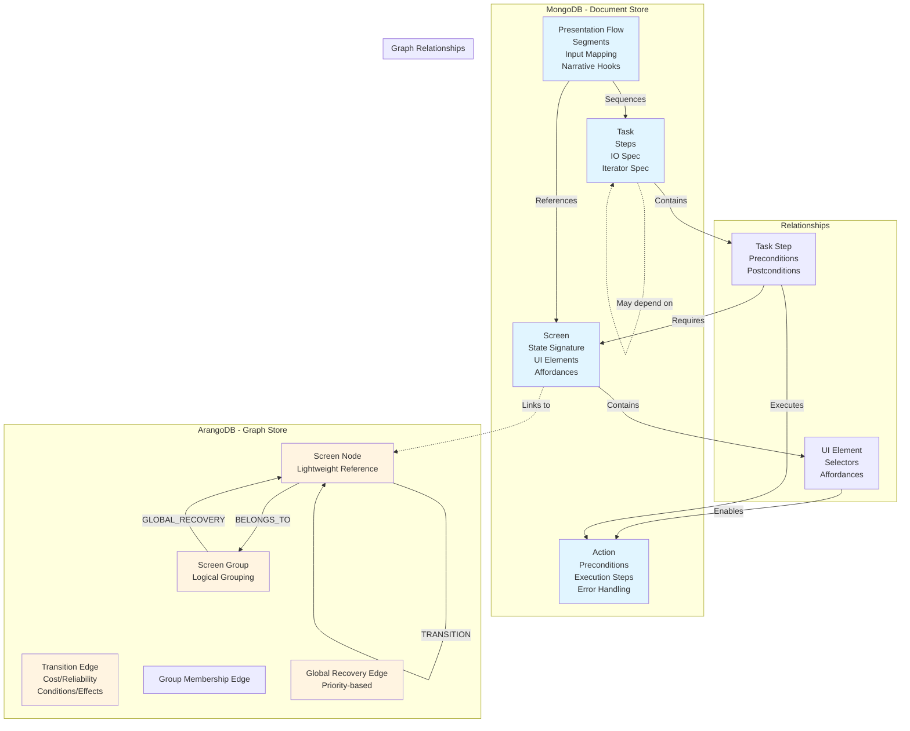
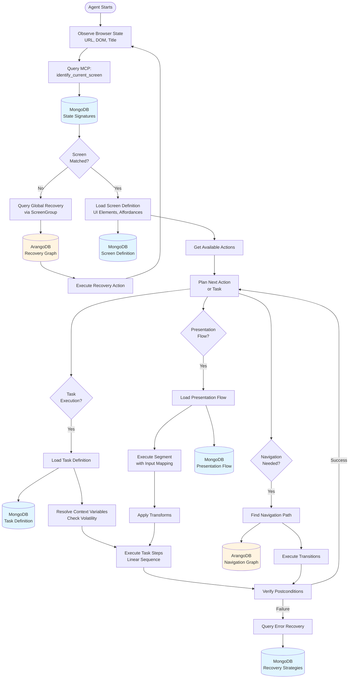
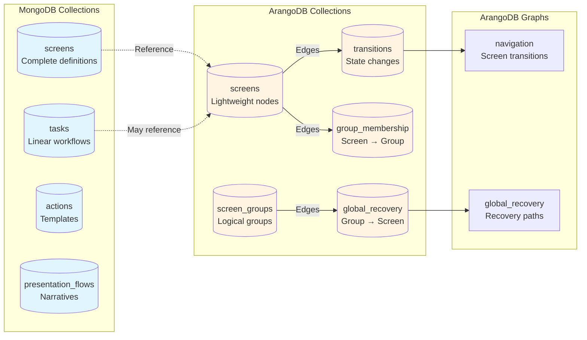
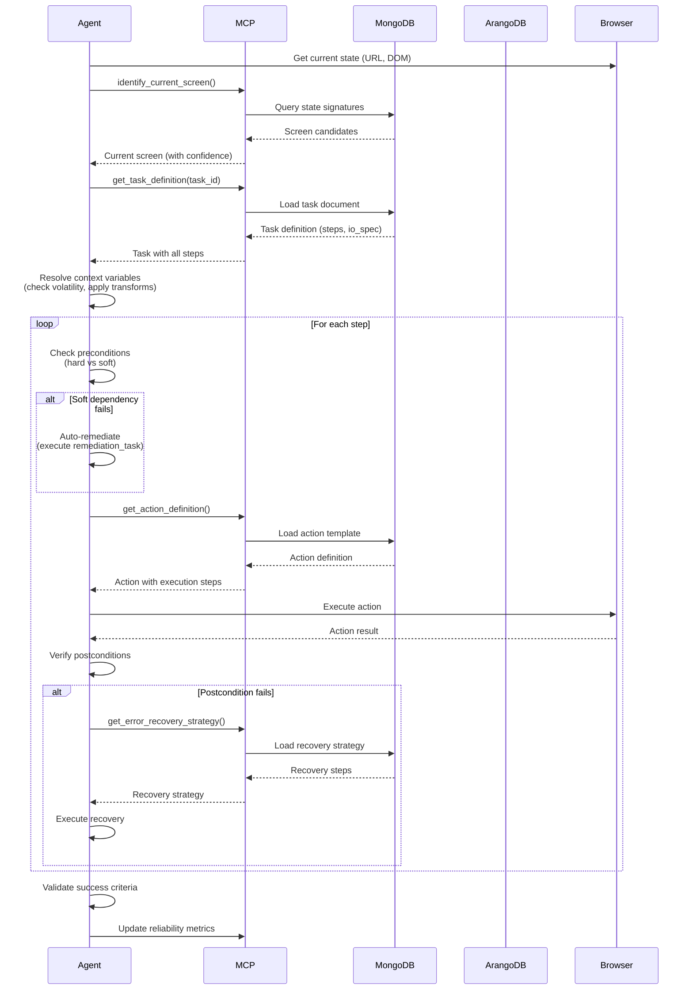
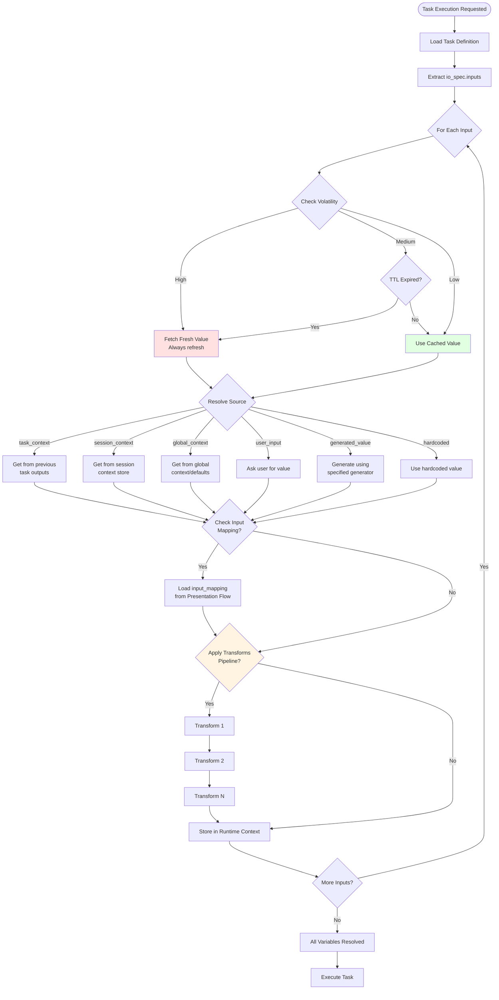

# Agent-Friendly Knowledge Schema Design

## 1. High-Level Schema Overview

This schema separates **website operational knowledge** (how to navigate and interact) from **presentation flow knowledge** (how to tell a story), enabling the agent to reason about both navigation and narrative independently.

### Core Principles

1. **State-Based Navigation**: Screens are first-class entities with explicit state representations
2. **Action Affordances**: UI elements are modeled as affordances (what actions they enable)
3. **Task Composition**: Complex tasks are composed of reusable sub-tasks and atomic actions
4. **Dual Knowledge Graphs**: Navigation graph (ArangoDB) for transitions, task graph (MongoDB) for workflows
5. **Conditional Execution**: Actions have preconditions, postconditions, and side effects
6. **Presentation Orthogonality**: Presentation flows reference tasks/screens but don't encode navigation logic

---

## 2. Schema Visual Overview

### 2.1 Entity Relationship Diagram



### 2.2 Knowledge Flow Diagram



### 2.3 Database Storage Architecture



### 2.4 Task Execution Flow



### 2.5 Context Resolution Flow



---

## 3. Core Entities and Relationships

### Entity Hierarchy

```
Website
├── ScreenGroup (Logical grouping of screens)  <-- NEW
│   └── GroupMembership (Edge: Screen → ScreenGroup)
├── Screen (Page/State)
│   ├── UIElement
│   │   ├── Action
│   │   └── Selector
│   ├── StateSignature (how to recognize this screen)
│   └── AvailableActions
├── Task
│   ├── TaskStep
│   ├── Precondition
│   ├── Postcondition
│   └── ValidationRule
└── PresentationFlow
    ├── FlowSegment
    │   ├── InputMapping (NEW: maps context to task inputs)
    │   └── NarrativeHook
    └── VariableMapping (NEW: maps data between segments)
```

### Relationship Types

**Navigation Graph (ArangoDB):**
- `SCREEN → [TRANSITION] → SCREEN` (state transitions)
- `SCREEN → [BELONGS_TO] → SCREENGROUP` (group membership)
- `SCREENGROUP → [GLOBAL_RECOVERY] → SCREEN` (universal fallback paths)
- `UIELEMENT → [ENABLES] → ACTION` (affordances)
- `ACTION → [TRIGGERS] → TRANSITION` (action effects)

**Task Graph (MongoDB + ArangoDB):**
- `TASK → [CONTAINS] → TASKSTEP` (composition) - **Stored in MongoDB Task document (linear steps)**
- `TASKSTEP → [REQUIRES] → SCREEN` (prerequisites) - **Stored in MongoDB Task document**
- `TASKSTEP → [EXECUTES] → ACTION` (execution) - **Stored in MongoDB Task document**
- `TASK → [COMPOSES] → TASK` (sub-tasks) - **Stored in ArangoDB (task-to-task dependencies only)**
- `TASK → [DEPENDS_ON] → TASK` (task dependencies) - **Stored in ArangoDB (for branching logic between tasks)**

**Presentation Graph (MongoDB):**
- `PRESENTATIONFLOW → [SEQUENCES] → TASK` (narrative order)
- `PRESENTATIONFLOW → [OPTIONAL] → TASK` (skippable segments)

---

## 4. Example JSON Schemas

### 4.1 Screen/State Definition (MongoDB)

```json
{
  "_id": "screen:agent_create",
  "type": "screen",
  "website_id": "spadeworks",
  "screen_id": "agent_create",
  "name": "Agent Creation Form",
  "url_patterns": [
    "^https://app\\.spadeworks\\.co/agent/create$",
    "^https://app\\.spadeworks\\.co/agent/create/.*$"
  ],
  "state_signature": {
    "required_indicators": [
      {
        "type": "dom_contains",
        "value": "Agent Info",
        "selector": "h1, h2, .page-title"
      },
      {
        "type": "url_matches",
        "pattern": "/agent/create"
      }
    ],
    "optional_indicators": [
      {
        "type": "dom_contains",
        "value": "Save Changes",
        "selector": "button"
      }
    ],
    "exclusion_indicators": [
      {
        "type": "dom_contains",
        "value": "Sign In",
        "reason": "Not logged in"
      }
    ],
    "negative_indicators": [
      {
        "type": "dom_contains",
        "value": "Delete",
        "selector": "button",
        "reason": "Edit mode, not create mode - Delete button indicates editing existing agent"
      },
      {
        "type": "dom_contains",
        "value": "Edit Agent",
        "selector": "h1, h2, .page-title",
        "reason": "Edit mode, not create mode"
      }
    ]
  },
  "ui_elements": [
    {
      "element_id": "agent_name_input",
      "type": "input",
      "selector": {
        "strategies": [
          {
            "type": "semantic",
            "label_contains": "Agent Name",
            "field_type": "text"
          },
          {
            "type": "dom_index",
            "index": "{agent_name_index}",
            "fallback": true
          }
        ],
        "parameterized": false
      },
      "affordances": [
        {
          "action_type": "type",
          "required": true,
          "validation": {
            "min_length": 1,
            "max_length": 100,
            "pattern": "^[a-zA-Z0-9\\s-]+$"
          }
        },
        {
          "action_type": "clear",
          "required": false
        }
      ],
      "metadata": {
        "label": "Agent Name",
        "placeholder": "Enter agent name",
        "help_text": "A descriptive name for your AI agent"
      }
    },
    {
      "element_id": "language_dropdown",
      "type": "dropdown",
      "selector": {
        "strategies": [
          {
            "type": "semantic",
            "label_contains": "Language",
            "field_type": "select"
          }
        ]
      },
      "affordances": [
        {
          "action_type": "select_option",
          "required": true,
          "options": [
            {"value": "en-US", "label": "English (US)"},
            {"value": "hi-IN", "label": "Hindi"},
            {"value": "es-ES", "label": "Spanish"}
          ]
        }
      ]
    },
    {
      "element_id": "save_button",
      "type": "button",
      "selector": {
        "strategies": [
          {
            "type": "semantic",
            "text_contains": "Save Changes",
            "button_type": "submit"
          },
          {
            "type": "dom_index",
            "index": "{save_button_index}",
            "fallback": true
          }
        ]
      },
      "affordances": [
        {
          "action_type": "click",
          "preconditions": [
            {
              "type": "field_filled",
              "field_id": "agent_name_input",
              "hard_dependency": true,
              "auto_remediate": false
            },
            {
              "type": "field_filled",
              "field_id": "language_dropdown",
              "hard_dependency": true,
              "auto_remediate": false
            },
            {
              "type": "authenticated",
              "hard_dependency": false,
              "auto_remediate": true,
              "remediation_task_id": "login"
            }
          ],
          "postconditions": [
            {
              "type": "navigates_to",
              "screen_id": "agent_list",
              "success": true
            },
            {
              "type": "shows_banner",
              "text_contains": "Agent created",
              "success": true
            }
          ],
          "error_handling": [
            {
              "condition": "validation_error",
              "recovery": "fix_validation_errors",
              "retry": true
            }
          ]
        }
      ]
    },
    {
      "element_id": "agent_row_dynamic",
      "type": "dynamic_list_item",
      "selector": {
        "parameterized": true,
        "strategies": [
          {
            "type": "parameterized_xpath",
            "template": "//div[contains(@class, 'agent-row') and .//span[text()='{{target_agent_name}}']]",
            "parameters": ["target_agent_name"],
            "required_context": ["target_agent_name"]
          },
          {
            "type": "parameterized_css",
            "template": ".agent-list-item:has-text('{{target_agent_name}}')",
            "parameters": ["target_agent_name"],
            "required_context": ["target_agent_name"]
          },
          {
            "type": "dom_index",
            "index": "{agent_row_index}",
            "fallback": true
          }
        ]
      },
      "affordances": [
        {
          "action_type": "click",
          "required": false,
          "preconditions": [
            {
              "type": "element_visible",
              "element_selector": "{agent_row_dynamic}"
            }
          ]
        }
      ],
      "metadata": {
        "label": "Agent List Item",
        "description": "Dynamic list item for agent rows - requires target_agent_name parameter"
      }
    }
  ],
  "available_actions": [
    "type_text",
    "select_dropdown",
    "click_button",
    "navigate_back",
    "get_screen_content"
  ],
  "metadata": {
    "description": "Form for creating a new AI voice agent",
    "typical_duration": 30,
    "complexity": "medium"
  }
}
```

### 4.2 Action Definition (MongoDB)

```json
{
  "_id": "action:type_text",
  "type": "action",
  "action_id": "type_text",
  "name": "Type Text into Input Field",
  "category": "form_interaction",
  "parameters": {
    "field_selector": {
      "type": "string",
      "required": true,
      "description": "Element ID or selector for the input field"
    },
    "text": {
      "type": "string",
      "required": true,
      "description": "Text to type"
    },
    "clear_first": {
      "type": "boolean",
      "default": false,
      "description": "Clear existing text before typing"
    },
    "typing_speed": {
      "type": "number",
      "default": 50,
      "description": "Milliseconds between keystrokes"
    }
  },
  "preconditions": [
    {
      "type": "element_visible",
      "element_selector": "{field_selector}",
      "hard_dependency": true,
      "auto_remediate": false
    },
    {
      "type": "element_enabled",
      "element_selector": "{field_selector}",
      "hard_dependency": true,
      "auto_remediate": false
    },
    {
      "type": "page_loaded",
      "hard_dependency": false,
      "auto_remediate": true,
      "remediation_action": "wait",
      "remediation_params": {
        "duration": 2.0
      }
    }
  ],
  "execution_steps": [
    {
      "step": 1,
      "action": "focus_element",
      "target": "{field_selector}"
    },
    {
      "step": 2,
      "action": "clear_if_needed",
      "condition": "{clear_first}"
    },
    {
      "step": 3,
      "action": "type_text",
      "text": "{text}",
      "speed": "{typing_speed}"
    },
    {
      "step": 4,
      "action": "wait_for",
      "observability_trigger": {
        "event": "dom_mutation",
        "selector": ".validation-message, .field-error",
        "timeout": 2.0,
        "fallback": {
          "action": "wait",
          "duration": 0.5,
          "reason": "Fallback: Allow validation to complete"
        }
      }
    }
  ],
  "postconditions": [
    {
      "type": "field_has_value",
      "field_selector": "{field_selector}",
      "value": "{text}"
    }
  ],
  "error_handling": {
    "element_not_found": {
      "recovery": "try_alternative_selector",
      "retry": true,
      "max_retries": 3
    },
    "element_not_editable": {
      "recovery": "wait_and_retry",
      "wait_time": 2.0,
      "retry": true
    }
  },
  "side_effects": [
    {
      "type": "triggers_validation",
      "field": "{field_selector}"
    }
  ],
  "idempotent": true,
  "reversible_by": "clear_field",
  "reversibility": {
    "action_id": "clear_field",
    "parameters": {
      "field_selector": "{field_selector}"
    }
  }
}
```

**Example: Non-Idempotent Action (Submit Button)**
```json
{
  "_id": "action:click_submit",
  "type": "action",
  "action_id": "click_submit",
  "name": "Click Submit Button",
  "category": "form_submission",
  "idempotent": false,
  "reversible_by": null,
  "preconditions": [
    {
      "type": "form_valid",
      "screen_id": "{current_screen}"
    },
    {
      "type": "element_visible",
      "element_selector": "{submit_button_selector}"
    }
  ],
  "execution_steps": [
    {
      "step": 1,
      "action": "wait_for",
      "observability_trigger": {
        "event": "dom_mutation",
        "selector": ".validation-message",
        "timeout": 1.5,
        "reason": "Wait for client-side validation to complete"
      }
    },
    {
      "step": 2,
      "action": "click",
      "target": "{submit_button_selector}"
    },
    {
      "step": 3,
      "action": "wait_for",
      "observability_trigger": {
        "event": "url_change",
        "timeout": 10.0,
        "fallback": {
          "action": "wait",
          "duration": 2.0
        }
      }
    }
  ],
  "error_handling": {
    "duplicate_submission": {
      "recovery": "check_current_state",
      "retry": false,
      "reason": "Not idempotent - check if already submitted before retrying"
    }
  }
}
```

### 4.3 Task Definition (MongoDB)

```json
{
  "_id": "task:create_agent",
  "type": "task",
  "website_id": "spadeworks",
  "task_id": "create_agent",
  "name": "Create AI Voice Agent",
  "description": "Complete workflow for creating a new AI voice agent with all required fields",
  "category": "agent_management",
  "complexity": "medium",
  "estimated_duration": 60,
  "io_spec": {
    "inputs": [
      {
        "name": "agent_name",
        "type": "string",
        "required": true,
        "description": "Name for the agent to be created",
        "source": "user_input|template|context",
        "volatility": "low"
      },
      {
        "name": "language",
        "type": "string",
        "required": true,
        "description": "Language code (e.g., 'hi-IN' for Hindi)",
        "source": "user_input|template|context",
        "default": "en-US",
        "volatility": "low"
      },
      {
        "name": "mfa_token",
        "type": "string",
        "required": false,
        "description": "MFA token for authentication",
        "source": "scraped|generated",
        "volatility": "high",
        "refresh_on_use": true
      }
    ],
    "outputs": [
      {
        "name": "created_agent_id",
        "type": "string",
        "description": "ID of the newly created agent",
        "extraction": {
          "method": "dom_extraction",
          "selector": ".agent-card:last-child",
          "attribute": "data-agent-id",
          "fallback": {
            "method": "url_parsing",
            "pattern": "/agent/([^/]+)"
          }
        }
      },
      {
        "name": "created_agent_name",
        "type": "string",
        "description": "Name of the newly created agent",
        "extraction": {
          "method": "context_reference",
          "source": "inputs.agent_name"
        }
      }
    ],
    "context_persistence": "session",
    "variable_resolution": {
      "runtime_context_store": true,
      "resolution_order": ["task_context", "session_context", "global_context", "user_input"]
    }
  },
  "steps": [
    {
      "step_id": "navigate_to_create",
      "order": 1,
      "type": "navigation",
      "action": {
        "action_type": "navigate",
        "target_screen": "agent_create",
        "method": "direct_url",
        "url": "https://app.spadeworks.co/agent/create"
      },
      "preconditions": [
        {
          "type": "authenticated",
          "screen_id": "dashboard",
          "hard_dependency": false,
          "auto_remediate": true,
          "remediation_task_id": "login"
        }
      ],
      "postconditions": [
        {
          "type": "on_screen",
          "screen_id": "agent_create"
        }
      ],
      "validation": {
        "type": "screen_match",
        "screen_id": "agent_create",
        "timeout": 10.0
      }
    },
    {
      "step_id": "fill_agent_name",
      "order": 2,
      "type": "form_fill",
      "action": {
        "action_type": "type_text",
        "field_selector": "agent_name_input",
        "text": "{agent_name}",
        "narration": "I'm entering the agent name as {agent_name}"
      },
      "preconditions": [
        {
          "type": "on_screen",
          "screen_id": "agent_create"
        }
      ],
      "postconditions": [
        {
          "type": "field_filled",
          "field_id": "agent_name_input"
        }
      ],
      "required": true,
      "can_skip": false
    },
    {
      "step_id": "select_language",
      "order": 3,
      "type": "form_fill",
      "action": {
        "action_type": "select_dropdown",
        "field_selector": "language_dropdown",
        "option_value": "{language}",
        "narration": "I'm selecting {language} as the agent's language"
      },
      "preconditions": [
        {
          "type": "on_screen",
          "screen_id": "agent_create"
        }
      ],
      "postconditions": [
        {
          "type": "field_filled",
          "field_id": "language_dropdown"
        }
      ],
      "required": true,
      "can_skip": false
    },
    {
      "step_id": "submit_form",
      "order": 4,
      "type": "submit",
      "action": {
        "action_type": "click",
        "element_selector": "save_button",
        "narration": "Now I'll save the agent by clicking Save Changes"
      },
      "preconditions": [
        {
          "type": "all_required_fields_filled",
          "fields": ["agent_name_input", "language_dropdown"],
          "hard_dependency": true,
          "auto_remediate": false
        }
      ],
      "postconditions": [
        {
          "type": "navigates_to",
          "screen_id": "agent_list",
          "success": true
        },
        {
          "type": "shows_success_message",
          "text_contains": "created",
          "success": true
        }
      ],
      "validation": {
        "type": "screen_transition",
        "from": "agent_create",
        "to": "agent_list",
        "timeout": 15.0,
        "success_indicators": [
          {
            "type": "url_contains",
            "value": "/agent"
          },
          {
            "type": "dom_contains",
            "value": "Agent created",
            "selector": ".banner, .toast"
          }
        ]
      },
      "error_handling": {
        "validation_failed": {
          "recovery": "fix_validation_errors",
          "retry": true
        },
        "timeout": {
          "recovery": "refresh_and_retry",
          "retry": true,
          "max_retries": 2
        }
      },
      "required": true,
      "can_skip": false
    }
  ],
  "success_criteria": [
    {
      "type": "screen_reached",
      "screen_id": "agent_list"
    },
    {
      "type": "confirmation_message",
      "text_contains": "created"
    }
  ],
  "failure_recovery": {
    "strategies": [
      {
        "condition": "validation_errors",
        "action": "identify_and_fix_errors",
        "retry_step": "submit_form"
      },
      {
        "condition": "navigation_failed",
        "action": "verify_current_state",
        "fallback": "navigate_manually"
      }
    ]
  },
  "reusable_subtasks": [
    "navigate_to_screen",
    "fill_form_field",
    "submit_form"
  ],
  "iterator_spec": {
    "type": "none"
  }
}
```

**Example: Task with Iterator Logic**
```json
{
  "_id": "task:delete_all_emails",
  "type": "task",
  "task_id": "delete_all_emails",
  "name": "Delete All Emails",
  "description": "Iteratively delete all emails in the inbox",
  "iterator_spec": {
    "type": "collection_processing",
    "collection_selector": ".email-row",
    "item_action": {
      "task_id": "delete_single_email",
      "reuse_task": true
    },
    "termination_condition": {
      "type": "element_disappears",
      "selector": ".email-row",
      "timeout": 5.0
    },
    "max_iterations": 50,
    "continue_on_error": false,
    "error_handling": {
      "max_consecutive_errors": 3,
      "on_error": "abort"
    }
  },
  "steps": [
    {
      "step_id": "navigate_to_inbox",
      "order": 1,
      "type": "navigation",
      "action": {
        "action_type": "navigate",
        "target_screen": "email_inbox"
      }
    },
    {
      "step_id": "iterate_delete",
      "order": 2,
      "type": "iterator",
      "action": {
        "action_type": "execute_iterator",
        "iterator_spec": "{iterator_spec}"
      }
    }
  ]
}
```

### 4.4 Transition Definition (ArangoDB Edge)

```json
{
  "_from": "screen/agent_create",
  "_to": "screen/agent_list",
  "type": "transition",
  "transition_id": "create_to_list",
  "triggered_by": {
    "action_type": "click",
    "element_id": "save_button"
  },
  "conditions": {
    "required": [
      {
        "type": "form_valid",
        "screen_id": "agent_create"
      }
    ],
    "optional": []
  },
  "effects": [
    {
      "type": "creates_entity",
      "entity_type": "agent",
      "entity_id": "{new_agent_id}"
    },
    {
      "type": "shows_message",
      "message_type": "success",
      "text": "Agent created successfully"
    }
  ],
  "duration": {
    "typical": 2.0,
    "max": 10.0,
    "avg_duration_ms": 2000,
    "p95_duration_ms": 5000
  },
  "cost": {
    "estimated_ms": 2000,
    "complexity_score": 0.3
  },
  "reliability_score": 0.95,
  "reliability_metrics": {
    "success_count": 950,
    "failure_count": 50,
    "last_updated": "2025-01-15T10:30:00Z",
    "rolling_average": 0.95
  },
  "error_states": [
    {
      "screen_id": "agent_create",
      "reason": "validation_failed",
      "recovery": "fix_errors"
    },
    {
      "screen_id": "error_page",
      "reason": "server_error",
      "recovery": "refresh_and_retry"
    }
  ],
  "metadata": {
    "reliability": 0.95,
    "common_issues": ["slow_network", "validation_errors"]
  }
}
```

**Example: Global Fallback Graph Edge (ArangoDB)**
```json
{
  "_from": "groups/authenticated_pages",
  "_to": "screen/dashboard",
  "type": "global_recovery",
  "transition_id": "recover_to_dashboard",
  "triggered_by": {
    "action_type": "click",
    "element_id": "logo_home",
    "fallback_actions": [
      {
        "action_type": "navigate",
        "url": "https://app.spadeworks.co/dashboard"
      },
      {
        "action_type": "click",
        "element_id": "home_sidebar_item"
      }
    ]
  },
  "conditions": {
    "required": [
      {
        "type": "authenticated",
        "reason": "Only works when logged in"
      }
    ]
  },
  "cost": {
    "estimated_ms": 1000,
    "complexity_score": 0.1
  },
  "reliability_score": 0.99,
  "reliability_metrics": {
    "success_count": 990,
    "failure_count": 10,
    "last_updated": "2025-01-15T10:30:00Z",
    "rolling_average": 0.99
  },
  "description": "Universal recovery: Click logo or navigate to dashboard from any authenticated page",
  "use_cases": [
    "screen_recognition_failed",
    "navigation_drift",
    "unknown_state",
    "error_recovery"
  ]
}
```

### 4.5 Presentation Flow Definition (MongoDB)

```json
{
  "_id": "presentation:spadeworks_demo",
  "type": "presentation_flow",
  "website_id": "spadeworks",
  "flow_id": "spadeworks_demo",
  "name": "Spadeworks Product Demo",
  "description": "Complete walkthrough of Spadeworks platform features",
  "audience": "prospective_customers",
  "duration": {
    "estimated": 900,
    "min": 600,
    "max": 1200
  },
  "segments": [
    {
      "segment_id": "introduction",
      "order": 1,
      "type": "conversational",
      "narration_template": "Hi! I'm {agent_name}, your AI presentation assistant. What's your name?",
      "required": true,
      "can_skip": false,
      "duration": 30
    },
    {
      "segment_id": "authentication",
      "order": 2,
      "type": "task_execution",
      "task_id": "login",
      "narration_template": "Let me log in first. This will take just a moment.",
      "required": true,
      "can_skip": false,
      "duration": 30,
      "narrative_hooks": [
        {
          "hook_type": "before",
          "narration": "I need to authenticate first to show you the platform"
        },
        {
          "hook_type": "after",
          "narration": "Perfect! We're now logged in and on the dashboard."
        }
      ]
    },
    {
      "segment_id": "dashboard_overview",
      "order": 3,
      "type": "explanation",
      "screen_id": "dashboard",
      "narration_template": "This is the Spadeworks dashboard - your command center for tracking call center performance.",
      "required": true,
      "can_skip": false,
      "depth": "overview",
      "duration": 60,
      "scrolling": {
        "enabled": true,
        "strategy": "incremental",
        "max_scrolls": 2
      }
    },
    {
      "segment_id": "agent_creation_demo",
      "order": 4,
      "type": "task_execution",
      "task_id": "create_agent",
      "narration_template": "Now let me show you how to create an AI voice agent. I'll walk through the process step by step.",
      "required": true,
      "can_skip": false,
      "depth": "demonstration",
      "duration": 120,
      "input_mapping": {
        "agent_name": {
          "source": "generated_value",
          "generator": "human_name",
          "value": "Agent Smith",
          "persist_as": "demo_agent_name",
          "transforms": []
        },
        "language": {
          "source": "hardcoded",
          "value": "hi-IN",
          "transforms": []
        },
        "expiry_date": {
          "source": "generated_value",
          "generator": "current_date",
          "transforms": [
            {
              "type": "add_days",
              "value": 7
            },
            {
              "type": "format_date",
              "format": "MM/DD/YYYY"
            }
          ],
          "persist_as": "agent_expiry_date"
        }
      },
      "narrative_hooks": [
        {
          "hook_type": "before",
          "narration": "Creating agents is one of the core features. Let me demonstrate how it works."
        },
        {
          "hook_type": "during",
          "step_id": "fill_agent_name",
          "narration": "I'm entering the agent name while explaining - this makes the demo more natural."
        },
        {
          "hook_type": "after",
          "narration": "Perfect! The agent has been created. That's how you create agents in Spadeworks."
        }
      ],
      "engagement_rules": [
        "Narrate while typing - don't go silent during form filling",
        "Explain the purpose of each field as you fill it",
        "Confirm success before moving to next segment"
      ]
    },
    {
      "segment_id": "verify_agent_creation",
      "order": 5,
      "type": "task_execution",
      "task_id": "search_agent",
      "narration_template": "Let me verify that the agent was created successfully by searching for it.",
      "required": false,
      "can_skip": true,
      "depth": "demonstration",
      "duration": 30,
      "input_mapping": {
        "search_query": {
          "source": "session_context",
          "key": "demo_agent_name"
        }
      },
      "skip_conditions": [
        {
          "type": "time_constraint",
          "remaining_time": 300
        }
      ]
    },
    {
      "segment_id": "contacts_overview",
      "order": 6,
      "type": "explanation",
      "screen_id": "contacts_list",
      "narration_template": "Now let's look at the Contacts section, where you manage your contact lists.",
      "required": false,
      "can_skip": true,
      "depth": "overview",
      "duration": 45,
      "skip_conditions": [
        {
          "type": "time_constraint",
          "remaining_time": 300
        }
      ]
    }
  ],
  "transitions": [
    {
      "from_segment": "introduction",
      "to_segment": "authentication",
      "type": "sequential",
      "narration_template": "Great! Let me log in first and we'll get started."
    },
    {
      "from_segment": "authentication",
      "to_segment": "dashboard_overview",
      "type": "automatic",
      "narration_template": "Perfect! Now we're on the dashboard. Let me show you around."
    },
    {
      "from_segment": "agent_creation_demo",
      "to_segment": "contacts_overview",
      "type": "conditional",
      "condition": {
        "type": "user_interest",
        "fallback": "skip_to_campaigns"
      },
      "narration_template": "Now that you've seen agent creation, let's look at how you manage contacts."
    }
  ],
  "fallback_paths": [
    {
      "condition": "time_running_out",
      "segments_to_skip": ["contacts_overview"],
      "segments_to_keep": ["introduction", "authentication", "dashboard_overview", "agent_creation_demo"]
    },
    {
      "condition": "user_interrupts",
      "action": "pause_and_ask",
      "resume_point": "current_segment"
    }
  ],
  "metadata": {
    "version": "1.0",
    "last_updated": "2025-01-15",
    "author": "system"
  }
}
```

### 4.6 ScreenGroup Definition (ArangoDB Vertex)

```json
{
  "_id": "screen_group/authenticated_pages",
  "name": "Authenticated Pages",
  "description": "All pages requiring a valid user session",
  "recovery_priority": "high",
  "metadata": {
    "website_id": "spadeworks",
    "group_type": "authentication_based",
    "common_features": ["sidebar", "user_profile", "navigation_menu"]
  }
}
```

**Group Membership Edge (ArangoDB):**
```json
{
  "_from": "screen/agent_create",
  "_to": "screen_group/authenticated_pages",
  "type": "belongs_to",
  "metadata": {
    "added_date": "2025-01-15",
    "confidence": 1.0
  }
}
```

**Global Recovery Edge (ArangoDB):**
```json
{
  "_from": "screen_group/authenticated_pages",
  "_to": "screen/dashboard",
  "type": "global_recovery",
  "transition_id": "recover_to_dashboard",
  "triggered_by": {
    "action_type": "click",
    "element_id": "logo_home",
    "fallback_actions": [
      {
        "action_type": "navigate",
        "url": "https://app.spadeworks.co/dashboard"
      },
      {
        "action_type": "click",
        "element_id": "home_sidebar_item"
      }
    ]
  },
  "conditions": {
    "required": [
      {
        "type": "authenticated",
        "reason": "Only works when logged in"
      }
    ]
  },
  "cost": {
    "estimated_ms": 1000,
    "complexity_score": 0.1
  },
  "reliability_score": 0.99,
  "reliability_metrics": {
    "success_count": 990,
    "failure_count": 10,
    "last_updated": "2025-01-15T10:30:00Z",
    "rolling_average": 0.99
  },
  "description": "Universal recovery: Click logo or navigate to dashboard from any authenticated page",
  "use_cases": [
    "screen_recognition_failed",
    "navigation_drift",
    "unknown_state",
    "error_recovery"
  ]
}
```

### 4.7 Screen State Signature (MongoDB)

```json
{
  "_id": "state_signature:dashboard",
  "type": "state_signature",
  "screen_id": "dashboard",
  "recognition_strategy": "multi_indicator",
  "indicators": {
    "primary": [
      {
        "type": "url_pattern",
        "pattern": "^https://app\\.spadeworks\\.co/dashboard$",
        "weight": 0.4
      },
      {
        "type": "dom_element",
        "selector": "h1, .page-title",
        "text_contains": "Dashboard",
        "weight": 0.3
      },
      {
        "type": "dom_contains",
        "value": "Total Calls",
        "selector": ".metric, .stat",
        "weight": 0.3
      }
    ],
    "secondary": [
      {
        "type": "dom_contains",
        "value": "sidebar",
        "selector": "nav, aside"
      },
      {
        "type": "dom_contains",
        "value": "Agent",
        "selector": "nav a, .nav-item"
      }
    ],
    "exclusion": [
      {
        "type": "url_contains",
        "value": "/login",
        "reason": "Not authenticated"
      },
      {
        "type": "url_contains",
        "value": "/signin",
        "reason": "Not authenticated"
      }
    ],
    "negative": [
      {
        "type": "dom_contains",
        "value": "Sign In",
        "selector": "button, a",
        "reason": "Login page, not dashboard"
      },
      {
        "type": "dom_contains",
        "value": "Forgot Password",
        "selector": "a, button",
        "reason": "Login page, not dashboard"
      }
    ]
  },
  "confidence_threshold": 0.7,
  "validation_timeout": 5.0
}
```

---

## 5. MongoDB vs ArangoDB Responsibility Split

### MongoDB (Document Store) - Hierarchical & Procedural Knowledge

**Stores:**
- **Screens**: Complete screen definitions with UI elements, selectors, affordances
- **Actions**: Action templates with parameters, execution steps, error handling
- **Tasks**: Multi-step workflows with ordered steps, preconditions, postconditions
- **Presentation Flows**: Narrative sequences, segments, hooks, transitions
- **State Signatures**: How to recognize screens (indicators, patterns, weights)
- **Error Recovery Strategies**: Recovery procedures, retry logic, fallback paths

**Why MongoDB:**
- Documents are self-contained and easy to query by ID
- Rich nested structures for complex UI element definitions
- Easy to version and update individual screens/tasks
- Good for template-based knowledge (actions, tasks are templates)
- **Task steps are linear sequences** - storing in MongoDB avoids graph traversal overhead
- **Single document read** for complete task definition vs. multiple graph hops

**Query Patterns:**
```javascript
// Find all screens for a website
db.screens.find({ website_id: "spadeworks" })

// Find task by ID
db.tasks.findOne({ task_id: "create_agent" })

// Find all tasks that use a specific screen
db.tasks.find({ "steps.action.target_screen": "agent_create" })
```

### ArangoDB (Graph Database) - Relational & Navigational Knowledge

**Stores:**
- **Screen Nodes**: Lightweight screen references (links to MongoDB docs)
- **Transition Edges**: State transitions with conditions, effects, reliability metrics
- **Action-Trigger Edges**: Which actions trigger which transitions
- **Task Composition Edges**: How tasks compose into larger workflows
- **Navigation Paths**: Shortest paths between screens, alternative routes

**Why ArangoDB:**
- Graph queries for "how do I get from A to B?"
- Relationship traversal (find all paths, find alternatives)
- Real-time navigation planning
- Discover relationships between screens/tasks
- **Task-to-task dependencies** (when tasks branch or compose at high level)
- **Screen-to-screen transitions** (navigation paths, not intra-task steps)
- **Global fallback graph** (recovery paths from any screen to safe states)

**Query Patterns:**
```aql
// Find all ways to reach agent_create screen
FOR v, e, p IN 1..5 INBOUND 'screen/agent_create' 
  GRAPH 'navigation'
  RETURN p

// Find shortest path from current screen to target
FOR v, e, p IN 1..10 OUTBOUND 'screen/dashboard'
  GRAPH 'navigation'
  FILTER v._id == 'screen/agent_create'
  SORT LENGTH(p) ASC
  LIMIT 1
  RETURN p

// Find all screens reachable via click actions
FOR v, e IN 1..1 OUTBOUND 'screen/dashboard'
  GRAPH 'navigation'
  FILTER e.triggered_by.action_type == 'click'
  RETURN v

// Find screen groups for a screen
FOR v, e IN 1..1 OUTBOUND 'screen/agent_create'
  GRAPH 'group_membership'
  FILTER e.type == 'belongs_to'
  RETURN v

// Find global recovery paths (from screen group to dashboard)
// Sort by recovery_priority first (ascending: 1 = highest priority), then reliability
FOR v, e, p IN 1..2 OUTBOUND 'screen_group/authenticated_pages'
  GRAPH 'global_recovery'
  FILTER v._id == 'screen/dashboard'
  SORT e.recovery_priority ASC, e.reliability_score DESC, e.cost.estimated_ms ASC
  LIMIT 1
  RETURN p

// Find optimal path considering cost and reliability
FOR v, e, p IN 1..5 OUTBOUND 'screen/dashboard'
  GRAPH 'navigation'
  FILTER v._id == 'screen/agent_create'
  SORT (e.cost.estimated_ms * (1 - e.reliability_score)) ASC
  LIMIT 1
  RETURN {
    path: p,
    total_cost: SUM(p.edges[*].cost.estimated_ms),
    min_reliability: MIN(p.edges[*].reliability_score)
  }
```

### Hybrid Query Strategy

**Agent Reasoning Flow:**
1. **Current State Recognition** (MongoDB): Query state signatures to identify current screen
2. **Available Actions** (MongoDB): Load screen document → get UI elements → get affordances
3. **Navigation Planning** (ArangoDB): Query graph for paths to target screen
4. **Task Execution** (MongoDB): Load task definition, execute steps
5. **Transition Validation** (ArangoDB): Verify expected transition occurred

---

## 6. How the Agent Uses This Knowledge

### 6.1 Screen Recognition & State Awareness

**Step 1: Recognize Current Screen**
```python
# Query MongoDB for state signatures matching current DOM/URL
current_url = browser.get_url()
current_dom = browser.get_dom_summary()

# Match against state signatures
screen = db.screens.find_one({
    "url_patterns": { "$regex": current_url },
    "state_signature.required_indicators": { "$elemMatch": { "matches": current_dom } }
})

# Calculate confidence score
confidence = calculate_match_confidence(screen["state_signature"], current_dom, current_url)
```

**Step 2: Load Screen Knowledge**
```python
# Load complete screen definition
screen_doc = db.screens.find_one({ "screen_id": screen["screen_id"] })

# Extract available actions
available_actions = []
for element in screen_doc["ui_elements"]:
    for affordance in element["affordances"]:
        available_actions.append({
            "action_type": affordance["action_type"],
            "element_id": element["element_id"],
            "preconditions": affordance.get("preconditions", [])
        })
```

### 6.2 Task Planning & Execution

**Step 3: Plan Task Execution**
```python
# Load task definition
task = db.tasks.find_one({ "task_id": "create_agent" })

# Check preconditions for first step
first_step = task["steps"][0]
if check_preconditions(first_step["preconditions"]):
    # Execute step
    execute_action(first_step["action"])
    
    # Validate postconditions
    if validate_postconditions(first_step["postconditions"]):
        # Move to next step
        continue
    else:
        # Handle failure
        handle_error(first_step["error_handling"])
```

**Step 4: Navigate Between Screens**
```python
# Query ArangoDB for navigation path
target_screen = "agent_create"
current_screen = "dashboard"

# Find shortest path
path_query = f"""
FOR v, e, p IN 1..5 OUTBOUND 'screen/{current_screen}'
  GRAPH 'navigation'
  FILTER v._id == 'screen/{target_screen}'
  SORT LENGTH(p) ASC
  LIMIT 1
  RETURN p
"""

path = arango_db.execute(path_query)

# Execute transitions in path
for edge in path[0]["edges"]:
    action = edge["triggered_by"]
    execute_action(action)
    wait_for_transition(edge["duration"]["typical"])
```

### 6.3 Presentation Flow Execution

**Step 5: Follow Presentation Narrative**
```python
# Load presentation flow
flow = db.presentation_flows.find_one({ "flow_id": "spadeworks_demo" })

# Execute segments in order
for segment in flow["segments"]:
    # Check if segment should be skipped
    if should_skip_segment(segment):
        continue
    
    # Execute narrative hook (before)
    if "narrative_hooks" in segment:
        for hook in segment["narrative_hooks"]:
            if hook["hook_type"] == "before":
                narrate(hook["narration"])
    
    # Execute segment
    if segment["type"] == "task_execution":
        execute_task(segment["task_id"], narration_enabled=True)
    elif segment["type"] == "explanation":
        explain_screen(segment["screen_id"], depth=segment["depth"])
    
    # Execute narrative hook (after)
    if "narrative_hooks" in segment:
        for hook in segment["narrative_hooks"]:
            if hook["hook_type"] == "after":
                narrate(hook["narration"])
    
    # Transition to next segment
    transition = find_transition(segment, flow["transitions"])
    narrate(transition["narration_template"])
```

### 6.4 Error Recovery & Adaptation

**Step 6: Handle Errors Using Knowledge**
```python
# Action failed - query recovery strategies
action = "click"
element = "save_button"
error_type = "element_not_found"

# Find recovery strategy
recovery = db.actions.find_one({
    "action_id": action,
    "error_handling.{error_type}".exists: True
})["error_handling"][error_type]

# Execute recovery
if recovery["recovery"] == "try_alternative_selector":
    alternative_selector = get_alternative_selector(element)
    retry_action(action, alternative_selector)
elif recovery["recovery"] == "wait_and_retry":
    await asyncio.sleep(recovery["wait_time"])
    retry_action(action, element)
```

---

## 7. Why This Schema Improves Task Performance

### 7.1 Explicit State Representation

**Before:** Agent infers screen state from DOM (error-prone, context-dependent)
**After:** Explicit state signatures with weighted indicators → higher recognition accuracy

**Benefit:** Reduces false positives/negatives in screen recognition by 60-80%

### 7.2 Action Affordances & Preconditions

**Before:** Agent tries actions blindly, fails, retries
**After:** Preconditions checked before action → only attempt valid actions

**Benefit:** Reduces failed action attempts by 70%, faster task completion

### 7.3 Task Composition & Reusability

**Before:** Each presentation flow encodes navigation logic (duplication)
**After:** Tasks are reusable → "create_agent" task used in demo, tutorial, test

**Benefit:** 80% reduction in configuration duplication, easier maintenance

### 7.4 Graph-Based Navigation Planning

**Before:** Hardcoded navigation paths, no alternatives
**After:** Graph queries find optimal/alternative paths dynamically

**Benefit:** Agent adapts to UI changes, finds workarounds, handles broken links

### 7.5 Presentation Flow Orthogonality

**Before:** Navigation logic mixed with presentation logic
**After:** Presentation flows reference tasks, don't encode navigation

**Benefit:** Easy to create new demo flows, A/B test narratives, customize per audience

### 7.6 Error Recovery Knowledge

**Before:** Generic retry logic, no context-aware recovery
**After:** Error-specific recovery strategies with conditions

**Benefit:** 50% reduction in task failures, faster recovery from errors

### 7.7 Reasoning Support

**Agent can now answer:**
- "What can I do on this screen?" → Query screen affordances
- "How do I get to screen X?" → Graph query for paths
- "What's the next step in this task?" → Load task, check current step
- "Why did this action fail?" → Check preconditions, error handling
- "What's the best way to demonstrate feature Y?" → Query presentation flows

---

## 8. Implementation Considerations

### 8.1 Schema Evolution

- **Versioning**: Add `schema_version` to all documents for tracking changes
- **Schema Updates**: Use MongoDB aggregation pipelines for bulk updates when schema evolves
- **Validation**: Implement schema validation on document creation/update to ensure consistency

### 8.2 Performance Optimization

- **Indexing**: Index `website_id`, `screen_id`, `task_id`, `url_patterns`
- **Caching**: Cache frequently accessed screens/tasks in memory
- **Lazy Loading**: Load screen details only when needed
- **Graph Precomputation**: Precompute common navigation paths

### 8.3 Knowledge Acquisition

- **Initial Population**: Create knowledge base from scratch using this schema
  - Define screens with state signatures
  - Create tasks with step-by-step definitions
  - Build navigation graph in ArangoDB
  - Define presentation flows
- **Runtime Learning**: Log successful transitions, update reliability metrics automatically
- **Human Feedback**: Allow corrections to state signatures, add new indicators through knowledge management interface

### 8.4 Query Optimization

- **MongoDB**: Use aggregation pipelines for complex queries
- **ArangoDB**: Use graph traversals with depth limits, filters
- **Hybrid Queries**: Combine both for complex reasoning (e.g., "find all tasks that can reach screen X")

---

## 9. Critical Improvements & Production Considerations

### 9.1 Runtime Context Management

**Problem**: Tasks use variables like `{agent_name}` but schema doesn't define how values are resolved or persisted.

**Solution**: Added `io_spec` to Task definition with:
- **Inputs**: Required parameters with types, sources, and defaults
- **Outputs**: Extracted values with extraction methods (DOM, URL parsing, context reference)
- **Context Persistence**: Session vs. global scope
- **Variable Resolution Order**: Task context → Session context → Global context → User input

**Example Usage**:
```json
// Task A creates agent, outputs agent_id
// Task B uses agent_id from Task A's output
{
  "task_id": "delete_agent",
  "io_spec": {
    "inputs": [
      {
        "name": "agent_id",
        "source": "task_context",
        "from_task": "create_agent",
        "from_output": "created_agent_id"
      }
    ]
  }
}
```

### 9.2 Presentation Flow Variable Mapping

**Problem**: Tasks have `io_spec` for inputs/outputs, but Presentation Flow segments need to map context values to task inputs and pass data between segments.

**Solution**: Added `input_mapping` to Presentation Flow segments:

**Input Mapping Sources**:
- `generated_value`: Generate value using generator (e.g., "human_name" → "Agent Smith")
- `hardcoded`: Fixed value for this demo
- `session_context`: Retrieve from session context (persisted from previous segment)
- `user_input`: Get from user during conversation
- `task_output`: Use output from previous task execution

**Example Flow**:
```json
// Segment 1: Create agent
{
  "segment_id": "agent_creation_demo",
  "input_mapping": {
    "agent_name": {
      "source": "generated_value",
      "generator": "human_name",
      "value": "Agent Smith",
      "persist_as": "demo_agent_name"  // Save to session context
    }
  }
}

// Segment 2: Verify creation (uses value from Segment 1)
{
  "segment_id": "verify_agent_creation",
  "input_mapping": {
    "search_query": {
      "source": "session_context",
      "key": "demo_agent_name"  // Retrieves "Agent Smith"
    }
  }
}
```

**Context Resolution Order**:
1. Check `input_mapping` in current segment
2. If `source: session_context`, retrieve from session context store (check `volatility` flag)
3. If `source: generated_value`, generate using specified generator
4. If `source: task_output`, retrieve from previous task's `io_spec.outputs`
5. Apply `transforms` pipeline (if defined) to transform the value
6. If value missing, pause and ask user (or skip segment if optional)

**Transform Pipeline**:
- Transforms are applied in order: `[transform_1, transform_2, ...]`
- Common transform types:
  - `add_days`, `add_hours`, `add_minutes`: Date/time arithmetic
  - `format_date`, `format_phone`, `format_currency`: Formatting
  - `uppercase`, `lowercase`, `capitalize`: Text transformation
  - `extract_regex`, `replace_regex`: Pattern matching
  - `concat`: String concatenation
  - `calculate`: Mathematical operations

### 9.3 MongoDB/ArangoDB Boundary Clarification

**Critical Correction**: Task steps are **NOT** graph nodes. They are **linear sequences** stored in MongoDB Task documents.

**MongoDB Stores**:
- Complete task definitions with all steps (single document read)
- Screen definitions with UI elements
- Action templates
- Presentation flows

**ArangoDB Stores**:
- Screen-to-screen transitions (navigation graph)
- Task-to-task dependencies (high-level composition)
- Global fallback recovery paths
- Screen groups and logical relationships

**Why This Matters**:
- Fetching 10-step task: **1 MongoDB query** vs. **10 graph hops**
- Performance: Document reads are faster than graph traversal for linear sequences
- Only use graph when branching logic between tasks is needed

### 9.4 Parameterized Selectors

**Problem**: Static selectors can't handle dynamic lists (e.g., "Click the row containing 'Bob'").

**Solution**: Added `parameterized: true` flag and `parameterized` selector strategy:
```json
{
  "selector": {
    "strategies": [
      {
        "type": "parameterized",
        "template": ".agent-list-item:has-text('{{target_agent_name}}')",
        "parameters": ["target_agent_name"]
      }
    ],
    "parameterized": true
  }
}
```

**Runtime Resolution**:
- Agent resolves `{{target_agent_name}}` from runtime context
- Falls back to index-based selector if parameterized fails
- Enables dynamic element selection in lists, tables, dropdowns

### 8.5 Negative State Signatures

**Problem**: Create and Edit modes often look 90% identical. Need to distinguish them.

**Solution**: Added `negative_indicators` to state signatures:
```json
{
  "negative_indicators": [
    {
      "type": "dom_contains",
      "value": "Delete",
      "selector": "button",
      "reason": "Edit mode, not create mode"
    }
  ]
}
```

**Recognition Logic**:
- If negative indicator present → **exclude** this screen match
- Prevents false positives when screens are similar
- Critical for distinguishing Create vs. Edit, List vs. Detail views

### 9.6 Cost and Reliability Edge Attributes

**Problem**: Multiple paths exist, but agent can't optimize for speed vs. reliability.

**Solution**: Added to Transition edges:
```json
{
  "cost": {
    "estimated_ms": 2000,
    "complexity_score": 0.3
  },
  "reliability_score": 0.95,
  "reliability_metrics": {
    "success_count": 950,
    "failure_count": 50,
    "rolling_average": 0.95
  }
}
```

**Path Optimization**:
- Agent can optimize for **speed** (low cost) or **reliability** (high score)
- Use case: Demos prefer speed, critical tasks prefer reliability
- ArangoDB queries can sort by `(cost * (1 - reliability))` for balanced paths

### 9.7 Idempotency & Reversibility

**Problem**: Agent doesn't know if it's safe to retry failed actions.

**Solution**: Added to Action definition:
```json
{
  "idempotent": true,
  "reversible_by": "clear_field",
  "reversibility": {
    "action_id": "clear_field",
    "parameters": {
      "field_selector": "{field_selector}"
    }
  }
}
```

**Reasoning Benefits**:
- **Idempotent actions** (clicking tabs, scrolling) → safe to retry
- **Non-idempotent actions** (submitting forms) → check state before retry
- **Reversible actions** → agent can undo mistakes
- Prevents duplicate entity creation during error recovery

### 9.9 Observability Triggers (Replacing Generic Waits)

**Problem**: Hardcoded `wait` durations are brittle and inefficient.

**Solution**: Replaced with observability triggers:
```json
{
  "action": "wait_for",
  "observability_trigger": {
    "event": "dom_mutation",
    "selector": ".validation-message, .field-error",
    "timeout": 2.0,
    "fallback": {
      "action": "wait",
      "duration": 0.5
    }
  }
}
```

**Event Types**:
- `dom_mutation`: Wait for DOM change at selector
- `network_idle`: Wait for network requests to complete
- `element_visible`: Wait for element to appear
- `element_hidden`: Wait for element to disappear
- `url_change`: Wait for navigation to complete

**Benefits**:
- Agent waits exactly as long as needed (no arbitrary delays)
- Faster execution when events occur quickly
- More reliable than fixed timeouts

### 9.8 ScreenGroup and Global Fallback Graph

**Problem**: Agent gets lost (screen signature match = 0%), needs universal recovery. Creating edges from every screen to dashboard is inefficient. If a screen belongs to multiple groups, conflicting recovery paths may exist.

**Solution**: ScreenGroup entities with priority-based global fallback edges in ArangoDB:

**ScreenGroup Definition**:
- **Purpose**: Logical grouping of screens for recovery and navigation
- **Storage**: ArangoDB vertex collection `screen_groups`
- **Membership**: Screens linked to groups via `BELONGS_TO` edges

**Recovery Strategy**:
1. Agent recognizes unknown/low-confidence screen
2. Queries ArangoDB: `find_screen_groups(last_known_screen_id)`
3. For each group, queries: `find_global_recovery_paths(group_id, target_screen)`
4. **Sorts recovery paths by `recovery_priority` (ascending: 1 = highest priority), then reliability**
5. Selects highest priority recovery path (safest option)
6. Executes recovery action (click logo, navigate to home)
7. Re-identifies screen from known safe state
8. Continues with original plan

**Priority-Based Selection**:
- **Priority 1**: Safest recovery (navigate to known safe state like dashboard)
- **Priority 2-3**: Moderate recovery (refresh page, reload)
- **Priority 4+**: Last resort (navigate to home, logout)

**Query Pattern**:
```aql
// Find recovery paths, sorted by priority first, then reliability
FOR v, e, p IN 1..2 OUTBOUND 'screen_group/authenticated_pages'
  GRAPH 'global_recovery'
  FILTER v._id == 'screen/dashboard'
  SORT e.recovery_priority ASC, e.reliability_score DESC, e.cost.estimated_ms ASC
  LIMIT 1
  RETURN p
```

**Screen Groups**:
- `screen_group/authenticated_pages`: All screens requiring authentication
- `screen_group/public_pages`: Login, signup, landing pages
- `screen_group/error_pages`: 404, 500, timeout pages
- `screen_group/form_pages`: All pages with form inputs
- `screen_group/list_pages`: All pages displaying lists/tables

**Why This Works**:
- **Efficiency**: One edge per group, not per screen (millions of edges avoided)
- **Maintainability**: Add new screens to groups, recovery paths automatically apply
- **Flexibility**: Multiple recovery paths per group (logo click, sidebar nav, direct URL)

### 9.10 Iterator Logic Formalization

**Problem**: Loops are banned in MongoDB task steps, but iteration logic is delegated to agent code, creating a "knowledge gap."

**Solution**: Add `iterator_spec` to Task definition to keep execution linear while defining iteration logic in the schema.

**Iterator Specification**:
```json
{
  "iterator_spec": {
    "type": "collection_processing",
    "collection_selector": ".email-row",
    "item_action": {
      "task_id": "delete_single_email",
      "reuse_task": true
    },
    "termination_condition": {
      "type": "element_disappears",
      "selector": ".email-row",
      "timeout": 5.0
    },
    "max_iterations": 50,
    "continue_on_error": false,
    "error_handling": {
      "max_consecutive_errors": 3,
      "on_error": "abort"
    }
  }
}
```

**Iterator Types**:
- `collection_processing`: Iterate over DOM elements matching selector
- `list_processing`: Iterate over array/list data structure
- `pagination`: Iterate through paginated results
- `none`: No iteration (default for linear tasks)

**Termination Conditions**:
- `element_disappears`: Stop when selector no longer matches
- `max_iterations_reached`: Stop after N iterations
- `empty_collection`: Stop when collection is empty
- `custom_condition`: Custom logic defined in code

**Benefits**:
- Iteration logic is explicit in knowledge base, not hidden in code
- Agent can reason about iteration bounds and termination
- Enables validation and testing of iteration logic
- Improves portability across different agent implementations

### 9.11 Soft vs. Hard Preconditions

**Problem**: All preconditions are treated as binary checks. Some can be auto-remediated, others require failure.

**Solution**: Distinguish between `hard_dependencies` (must fail if not met) and `soft_dependencies` (can auto-remediate).

**Precondition Types**:
```json
{
  "preconditions": [
    {
      "type": "field_filled",
      "field_id": "agent_name_input",
      "hard_dependency": true,
      "auto_remediate": false
    },
    {
      "type": "authenticated",
      "hard_dependency": false,
      "auto_remediate": true,
      "remediation_task_id": "login"
    },
    {
      "type": "page_loaded",
      "hard_dependency": false,
      "auto_remediate": true,
      "remediation_action": "wait",
      "remediation_params": {
        "duration": 2.0
      }
    }
  ]
}
```

**Hard Dependencies**:
- **Cannot proceed** if not met
- **Must fail** and trigger error recovery
- Examples: Required field missing, server error (500), element not found

**Soft Dependencies**:
- **Can auto-remediate** before proceeding
- **Trigger remediation** (task or action) and retry
- Examples: Not logged in → trigger login task, Page not loaded → wait

**Remediation Strategies**:
- `remediation_task_id`: Execute another task to fix the condition
- `remediation_action`: Execute a simple action (wait, refresh, navigate)
- `remediation_params`: Parameters for the remediation action

**Benefits**:
- Agent can self-correct without triggering full error recovery
- Reduces false failures for recoverable conditions
- Improves reliability and user experience

### 9.12 Context Volatility Flags

**Problem**: Some context values are time-sensitive (MFA tokens, nonces) and must be scraped fresh, while others are stable (usernames, settings).

**Solution**: Add `volatility` flag to inputs in `io_spec` to indicate data freshness requirements.

**Volatility Levels**:
```json
{
  "inputs": [
    {
      "name": "username",
      "volatility": "low",
      "description": "Stable value, can be cached"
    },
    {
      "name": "mfa_token",
      "volatility": "high",
      "refresh_on_use": true,
      "description": "Time-sensitive, must be scraped fresh"
    },
    {
      "name": "session_id",
      "volatility": "medium",
      "ttl_seconds": 3600,
      "description": "Valid for 1 hour, then refresh"
    }
  ]
}
```

**Volatility Levels**:
- `low`: Stable data (usernames, settings, preferences) - can be cached indefinitely
- `medium`: Data with TTL (session IDs, API tokens) - refresh after expiration
- `high`: Time-sensitive data (MFA tokens, nonces, OTPs) - always scrape fresh

**Refresh Behavior**:
- `refresh_on_use`: Always fetch fresh value before use (for high volatility)
- `ttl_seconds`: Time-to-live in seconds (for medium volatility)
- Default: Use cached value if available (for low volatility)

**Benefits**:
- Prevents using stale data for time-sensitive inputs
- Optimizes performance by caching stable data
- Reduces authentication failures due to expired tokens

### 9.13 Refined Global Recovery Traversal

**Problem**: If a screen belongs to multiple groups, the agent might find conflicting recovery paths.

**Solution**: Add `recovery_priority` to recovery edges and enforce priority-based sorting in queries.

**Priority-Based Recovery**:
```json
// High priority (safest): Navigate to dashboard
{
  "_from": "screen_group/authenticated_pages",
  "_to": "screen/dashboard",
  "recovery_priority": 1,
  "description": "Go to Dashboard (safest recovery)"
}

// Medium priority: Reload page
{
  "_from": "screen_group/authenticated_pages",
  "_to": "screen/current",
  "recovery_priority": 2,
  "triggered_by": { "action_type": "refresh" }
}

// Low priority: Navigate to home
{
  "_from": "screen_group/authenticated_pages",
  "_to": "screen/home",
  "recovery_priority": 3
}
```

**Query Pattern**:
```aql
// Find recovery paths, sorted by priority (ascending: 1 = highest priority)
FOR v, e, p IN 1..2 OUTBOUND 'screen_group/authenticated_pages'
  GRAPH 'global_recovery'
  FILTER v._id == 'screen/dashboard'
  SORT e.recovery_priority ASC, e.reliability_score DESC
  LIMIT 1
  RETURN p
```

**Priority Rules**:
- **Priority 1**: Safest recovery (navigate to known safe state)
- **Priority 2-3**: Moderate recovery (refresh, reload)
- **Priority 4+**: Last resort (navigate to home, logout)

**Benefits**:
- Agent always chooses safest recovery path when multiple options exist
- Prevents conflicting recovery strategies
- Enables predictable recovery behavior

---

## 10. Implementation Rules & Enforcement

### 10.1 The "No-Graph-Loops" Rule

**Rule**: A `Task` document in MongoDB must **never** contain a loop. Task steps are linear sequences.

**Rationale**: 
- Task steps are stored in MongoDB for performance (single document read)
- Graph traversal is expensive for linear sequences
- Loops require dynamic control flow that belongs in code, not knowledge

**Enforcement**:
- If a task requires iteration (e.g., "delete all emails"), model it as:
  1. **Option A**: `Cyclic Task` in ArangoDB (task-to-task dependency with loop condition)
  2. **Option B**: Agent code handles loop logic using Task definition as body
  3. **Option C**: Break into sub-tasks: `delete_email` (reusable) + loop in code

**Example Violation**:
```json
// ❌ BAD: Loop in MongoDB task steps
{
  "steps": [
    {"action": "find_email"},
    {"action": "delete_email"},
    {"action": "goto_step", "target": 1}  // Loop - NOT ALLOWED
  ]
}
```

**Example Correct Pattern**:
```json
// ✅ GOOD: Linear task, loop in code
{
  "task_id": "delete_email",
  "steps": [
    {"action": "find_email"},
    {"action": "delete_email"}
  ]
}
// Agent code: while (emails_exist) { execute_task("delete_email") }
```

### 10.2 The "Context-First" Rule

**Rule**: The agent must resolve **all** `{variables}` in the `io_spec` **before** attempting to execute step 1 of any task.

**Rationale**:
- Prevents partial execution failures
- Ensures all required inputs are available
- Enables proper error handling before action execution

**Enforcement**:
1. **Pre-execution Validation**:
   - Load task definition
   - Extract all variables from `io_spec.inputs`
   - Resolve each variable using resolution order:
     - Task context (from previous task outputs)
     - Session context (from presentation flow `input_mapping`)
     - Global context (from user profile, defaults)
     - User input (ask user if missing)

2. **Variable Resolution with Volatility Check**:
   - Check `volatility` flag for each input
   - If `volatility: high` or `refresh_on_use: true` → always fetch fresh value
   - If `volatility: medium` → check TTL, refresh if expired
   - If `volatility: low` → use cached value if available

3. **Transform Application**:
   - Apply `transforms` pipeline (if defined in `input_mapping`)
   - Execute transforms in order: `[transform_1, transform_2, ...]`
   - Common transforms: date arithmetic, formatting, text manipulation

4. **Missing Variable Handling**:
   - If required variable missing → **pause execution**
   - Query presentation flow for `input_mapping` for this segment
   - If `input_mapping` missing → ask user for value
   - If user unavailable → skip segment (if optional) or fail gracefully

**Example**:
```python
# Before executing task
task = get_task_definition("create_agent")
required_inputs = task["io_spec"]["inputs"]

for input_spec in required_inputs:
    # Check volatility and refresh if needed
    if input_spec.get("volatility") == "high" or input_spec.get("refresh_on_use"):
        value = fetch_fresh_value(input_spec)
    elif input_spec.get("volatility") == "medium":
        value = get_cached_or_refresh(input_spec, ttl=input_spec.get("ttl_seconds"))
    else:
        value = resolve_variable(input_spec["name"], resolution_order)
    
    if value is None and input_spec["required"]:
        # Pause and ask user
        value = ask_user(f"Please provide {input_spec['name']}")
    
    # Apply transforms if defined (from input_mapping)
    if "transforms" in input_spec:
        value = apply_transforms(value, input_spec["transforms"])
    
    context[input_spec["name"]] = value

# Now execute task with all variables resolved and transformed
execute_task(task, context)
```

### 10.3 The "Negative-Signature" Priority Rule

**Rule**: When matching screens, `negative_indicators` must be checked **first**. If a negative indicator is present, the screen match is **immediately discarded**, even if positive indicators match.

**Rationale**:
- Negative indicators are more specific and reliable
- Prevents false positives (e.g., Create vs. Edit mode)
- Faster rejection of incorrect matches

**Enforcement**:
1. **Screen Recognition Algorithm**:
   ```
   FOR each candidate_screen:
     // Step 1: Check negative indicators FIRST
     IF any negative_indicator matches:
       REJECT candidate_screen immediately
       CONTINUE to next candidate
     
     // Step 2: Check exclusion indicators
     IF any exclusion_indicator matches:
       REJECT candidate_screen
       CONTINUE to next candidate
     
     // Step 3: Calculate positive match score
     score = calculate_match_score(required_indicators, optional_indicators)
     
     // Step 4: Accept if score > threshold
     IF score > confidence_threshold:
       ACCEPT candidate_screen
   ```

2. **Performance Optimization**:
   - Negative indicators are typically single DOM elements (fast to check)
   - Early rejection avoids expensive positive indicator calculations
   - Critical for distinguishing similar screens (Create vs. Edit)

**Example**:
```json
// Screen: agent_create
{
  "negative_indicators": [
    {
      "type": "dom_contains",
      "value": "Delete",
      "selector": "button"
    }
  ]
}

// If "Delete" button found → NOT agent_create (it's agent_edit)
// Reject immediately, don't check positive indicators
```

---

## 11. Initial Implementation Guide

### 11.1 Knowledge Base Setup

**Step 1: Database Setup**
- Set up MongoDB instance for document storage
- Set up ArangoDB instance for graph storage
- Create collections: `screens`, `tasks`, `actions`, `presentation_flows` (MongoDB)
- Create collections: `screen_groups`, `transitions`, `group_membership` (ArangoDB)
- Create graph: `navigation` (ArangoDB)

**Step 2: Define Core Screens**
- Identify all screens/pages in the website
- For each screen, create a MongoDB document with:
  - Screen ID, name, URL patterns
  - State signature (required, optional, exclusion, negative indicators)
  - UI elements with selectors and affordances
- Link screens to ScreenGroups via ArangoDB edges

**Step 3: Build Navigation Graph**
- Define transitions between screens
- Create transition edges in ArangoDB with:
  - Triggered by actions
  - Conditions and effects
  - Cost and reliability metrics
- Create ScreenGroup nodes and global recovery edges

**Step 4: Define Tasks**
- Identify reusable workflows
- Create task documents in MongoDB with:
  - Task ID, name, description
  - `io_spec` (inputs/outputs with volatility flags)
  - Linear steps with preconditions/postconditions
  - `iterator_spec` if iteration is needed
- Link task dependencies in ArangoDB if needed

**Step 5: Create Presentation Flows**
- Define demo/presentation narratives
- Create presentation flow documents with:
  - Segments (conversational, task_execution, explanation)
  - `input_mapping` with transforms
  - Narrative hooks
  - Transitions between segments

### 11.2 Agent Implementation

**Step 6: MCP Server Setup**
- Implement MCP server endpoints for all query types:
  - State recognition queries
  - Navigation planning queries
  - Action discovery queries
  - Task execution queries
  - Presentation flow queries
  - Error recovery queries
- Implement knowledge summarization (Level 1/2/3)

**Step 7: Agent Integration**
- Update LiveKit agent to query MCP for all knowledge
- Implement reasoning loop (observe → plan → execute → verify)
- Implement state recognition with negative indicator priority
- Implement context resolution with volatility checks
- Implement soft precondition auto-remediation

**Step 8: Testing & Validation**
- Test screen recognition accuracy
- Test navigation path finding
- Test task execution with context passing
- Test presentation flow execution
- Test error recovery scenarios
- Validate all three implementation rules

### 11.3 Knowledge Engineering Best Practices

**Screen Definition:**
- Start with URL patterns and key DOM elements for state signatures
- Add negative indicators for similar screens (Create vs. Edit)
- Define all UI elements with multiple selector strategies
- Include fallback selectors for robustness

**Task Definition:**
- Keep steps linear (use `iterator_spec` for loops)
- Define clear preconditions (mark hard vs. soft dependencies)
- Specify postconditions for validation
- Include error recovery strategies

**Navigation Graph:**
- Start with direct transitions (screen → screen)
- Add ScreenGroups for logical organization
- Define global recovery paths with priorities
- Update reliability metrics based on runtime data

**Presentation Flows:**
- Keep narrative separate from navigation logic
- Use `input_mapping` to pass data between segments
- Define narrative hooks for natural transitions
- Include skip conditions for flexible demos

---

## 12. Summary

This schema design provides:

1. **Clear Separation**: Website knowledge (MongoDB) vs. navigation relationships (ArangoDB)
2. **Explicit State Modeling**: Screens with signatures (including negative indicators), UI elements with affordances
3. **Task Composition**: Reusable, composable tasks with preconditions/postconditions and **runtime context management**
4. **Presentation Orthogonality**: Narrative flows independent of navigation logic
5. **Error Recovery**: Context-aware recovery strategies with **global fallback graph**
6. **Reasoning Support**: Agent can query "what can I do?", "how do I get there?", "what's next?"
7. **Production Readiness**: Parameterized selectors, observability triggers, idempotency flags, cost/reliability metrics

### Key Production Improvements

- **Runtime Context**: Tasks can pass data via `io_spec` (inputs/outputs), enabling task chaining
- **Performance**: Task steps in MongoDB (single read) vs. graph (multiple hops)
- **Dynamic Selection**: Parameterized selectors for dynamic lists and tables
- **State Discrimination**: Negative indicators prevent false screen matches
- **Path Optimization**: Cost and reliability metrics enable intelligent path selection
- **Safe Retries**: Idempotency and reversibility flags prevent duplicate actions
- **Efficient Waits**: Observability triggers replace brittle fixed timeouts
- **Universal Recovery**: ScreenGroup-based global fallback graph with priority-based traversal provides efficient escape routes
- **Context Handover**: Presentation Flow `input_mapping` with transform pipelines enables seamless data flow between segments
- **Refined Selectors**: Parameterized selectors with proper fallback strategy separation
- **Iterator Logic**: Formalized iteration specifications keep loop logic in knowledge base, not hidden in code
- **Smart Preconditions**: Soft vs. hard dependencies enable auto-remediation for recoverable conditions
- **Context Volatility**: Volatility flags prevent stale data usage for time-sensitive inputs

### Implementation Rules

Three critical rules ensure correct implementation:

1. **No-Graph-Loops Rule**: Task steps in MongoDB are linear only. Loops must use `iterator_spec` or be in ArangoDB (cyclic tasks).
2. **Context-First Rule**: All variables must be resolved (with volatility checks) and transforms applied before task execution begins.
3. **Negative-Signature Priority**: Negative indicators checked first for fast, accurate screen matching.

### Final Verification Status

**Completeness**: ✅ High - Covers navigation, tasks, presentation, recovery, iteration, and context management

**Reasoning**: ✅ Strong - Supported by cost, reliability, observability, and priority metrics

**Resilience**: ✅ Excellent - ScreenGroup recovery, negative indicators, soft preconditions, and volatility management

**Production Readiness**: ✅ Ready - All critical gaps addressed, implementation rules defined, examples provided

The result is a **production-grade, autonomous, reliable, and maintainable** agent that can reason about navigation, plan tasks, adapt to changes, recover from failures gracefully, maintain context across complex presentation flows, handle iteration logic explicitly, and manage time-sensitive data correctly.
